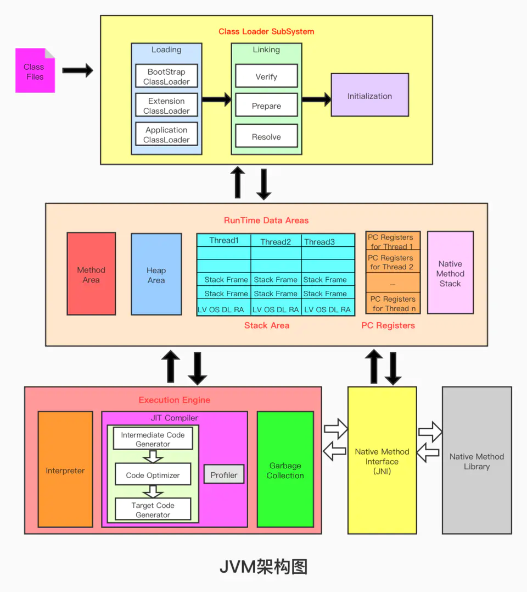

<p align="center">
  <a href="https://github.com/XiYun0/"></a>
</p>


溪云笔记

>github阅读：https://xiyun0.github.io/XiYun-Notes/#/
>
>gitee阅读（国内访问快）：http://xiyun0.gitee.io/xiyun-notes/


> 正在阅读的书籍、博客：深入理解计算机系统
>
> 正在做的项目：谷粒商城


>代码和绘图都放在了坚果云里面。
>
>语雀：https://www.yuque.com/kuangxiqiruogu


# 资源

1. [开源项目](其他/开源项目.md)
2. [视频](其他/视频.md)
3. [论文阅读](其他/论文阅读.m)
4. [我的书单](其他/书单.md)，[下载](https://www.yuque.com/kuangxiqiruogu/sglzt1)
5. [我的常用工具](其他/工具.md)，下载
6. [UP主、技术大神、大厂、培训机构](其他/UP主、技术大神)
7. [博客、文章](其他/blog.md)
8. [好用的网站](其他/好用的网站.md)

# 读书笔记

- 2021.3.19 [码农翻身](读书笔记/码农翻身.md)
- 2021.3.29 深入理解计算机系统
- 2021.4.26 操作系统哲学原理

# 面试、简历关

1. :crossed_swords:[面试—话术](其他/面试—纯话版.md):crossed_swords:
2. [面经](其他/面经.md)
3. [我的简历](其他/resume/我的简历.md)
4. https://github.com/resumejob/awesome-resume

# 计算机系统

## 计算机组成

> 书籍：
>
> - 深入理解计算机系统

1. [计算机系统漫游](计算机系统/计算机系统漫游.md)

## 操作系统

> 书籍：
>
> - 操作系统导论
> - 操作系统哲学原理

1. 基础原理篇
   1. [操作系统导论](计算机系统/操作系统/基础原理篇/操作系统导论.md)
   2. 操作系统历史
2. 虚拟化篇
   1. CPU
   2. 进程
   3. 线程
   4. [内存管理](计算机系统/操作系统/内存管理.md)
   5. [死锁](计算机系统/操作系统/死锁.md)
3. 持久化篇
   1. 磁盘
   2. 文件系统

### Linux

- [虚拟机Linux安装和宝塔](https://www.yuque.com/docs/share/dde3805e-0e52-4de6-b5b1-f7a88b4035e6?# )
- [Linux 基础知识](计算机系统/操作系统/linux/Linux基础知识.md)  
- [Shell 编程入门](计算机系统/操作系统/Shell.md) 

## 计算机网络


- [何为网络？](计算机系统/计算机网络/何为网络.md)
- [在地址栏输入www.baidu.com并回敲发生了什么？](计算机系统/计算机网络/在地址栏输入www.baidu.com并回敲发生了什么？.md)


1. [应用层](计算机系统/计算机网络/TCPIP族/应用层.md)
2. [传输层](计算机系统/计算机网络/TCPIP族/传输层.md)——运输商
3. [网络层](计算机系统/计算机网络/TCPIP族/网络层.md)
4. [数据链路层](计算机系统/计算机网络/TCPIP族/网络层.md)


## 数据结构与算法

> 视频：爱学习的饲养员

1. [时间复杂度](计算机系统/数据结构与算法/时间复杂度.md)
2. [空间复杂度](计算机系统/数据结构与算法/空间复杂度.md)

### 数据结构

> 工具

[数据结构知识学习与面试](计算机系统/数据结构与算法/数据结构/数据结构.md)


1. [数组Array](计算机系统/数据结构与算法/数据结构/数组.md)
2. [链表LinkedList](计算机系统/数据结构与算法/数据结构/链表.md)
   1. 双向链表
   2. 跳表
3. [队列Queue](计算机系统/数据结构与算法/数据结构/队列.md)
4. [栈Stack](计算机系统/数据结构与算法/数据结构/栈.md)
5. [哈希表HashTable](计算机系统/数据结构与算法/数据结构/哈希表.md)
6. [集合Set](计算机系统/数据结构与算法/数据结构/集合.md)
7. [树Tree](计算机系统/数据结构与算法/数据结构/树.md)
8. [堆Heap](计算机系统/数据结构与算法/数据结构/堆.md)
9. [图Graph](计算机系统/数据结构与算法/数据结构/图.md)

### 算法

> 实现的方法

1. [双指针](计算机系统/数据结构与算法/算法/双指针.md)
2. 二分查找
3. 递归
4. 分治
5. 回溯
6. 深度优先搜索
7. 宽度优先搜索
8. 贪心算法
9. 动态规划


1. [算法学习资源推荐](计算机系统/数据结构与算法/算法学习资源推荐.md)
2. [力扣和剑指](计算机系统/数据结构与算法/力扣和剑指.md)


## 分布式系统

> 视频：MIT 6.824

- [分布式系统简介](计算机系统/分布式系统/分布式系统简介.md)

1. Raft
2. 分区 K/V 服务器

### 架构


#### 抽象层面

1. [具备复制容错的高性能分布式存储](计算机系统/分布式系统/分布式存储.md)
2. 通信系统
3. [计算系统MapReduce](计算机系统/分布式系统/MapReduce.md)

#### 实现层面

1. RPC
2. 线程——结构化并发操作

### 性能

- [可扩展性](计算机系统/分布式系统/可扩展性.md)

### 容错性

> 大规模让小概率故障事件变成常见问题。
>
> 计算机总是会迷之崩溃、运行错误、运行缓慢
>
> 网络故障：大量的网线、交换机。如果有人踩到了网线，如果网络交换机风扇损坏导致交换机过热从而产生故障，都会导致网络不可靠。

1. [可用性](计算机系统/分布式系统/可用性.md)
2. [可恢复性](计算机系统/分布式系统/可恢复性.md)

### 一致性

```python
put(key,value)		# 更新表
get(key) -> value	# 将表中保存的那个版本给我
```

分布式系统中，由于复制或者缓存这些东西，会造成多个数据副本的存在。上面的键值对很可能有不同的版本。

```python
# 当前两台服务器的某个 (key,value) 为 (1, 20)
put(1, 21)	# 客户端CLient向一台服务器发送put命令
# 客户端突然出现故障，但是put操作已经完成
# 没有完成两台服务器的同步
```

强一致性的代价高昂

# 前端

## HTML


## CSS


## JavaScript

### JavaScript

1. [基础](前端/JavaScript/基础.md)
2. [事件](前端/JavaScript/事件.md)

### TypeScript

https://24kcs.github.io/vue3_study/00_%E8%AF%BE%E7%A8%8B%E4%BB%8B%E7%BB%8D.html

## Vue

- [vue3](前端/vue3.md)

### 表单设计工具

- [form-generator (gitee.io)](https://mrhj.gitee.io/form-generator/#/)

# 后端

## Java


### 基础

1. [Java 基础面试总结](后端/java/base/Java基础.md)
   1. [接口和抽象类](后端/java/base/接口和抽象类.md)
   2. 包装类：自动装箱与拆箱
   3. 泛型：为容器而生
   4. 异常：生病，生死无常
   5. 注解
   6. [Java 反射](后端/java/base/Java反射.md)
2. 新特性
   1. [Java 8 新特性总结](后端/java/What's%20New%20in%20JDK8/Java8Tutorial.md)

### IO

1. IO
2. [BIO,NIO,AIO 总结 ](后端/java/BIO-NIO-AIO.md)

### Netty

> 下面笔记跟着满一航老师的视频来

1. [NIO基础](后端/java/io/NIO基础.md)
2. [Netty入门](后端/java/io/Netty入门.md)
3. [Netty进阶](后端/java/io/Netty进阶.md)
4. [Netty优化与源码](后端/java/io/Netty优化与源码.md)

### 集合（容器）

> 容器类就是容纳并管理多项数据的类

1. [Java集合面试总结](后端/java/base/Java集合.md)
2. [HashMap](后端/java/base/HashMap.md)

### JVM

>Java与C++之间有一堵由内存动态分配和垃圾收集技术所围成的“高墙”，墙外面的人想进去，墙里面的人却想出来。

书籍推荐：《深入理解Java虚拟机》、《自己动手写Java虚拟机》、《Java性能权威指南》

视频推荐：尚硅谷宋红康、黑马满一航




1. [Class文件结构](后端/java/jvm/类文件结构.md)
2. 类加载器子系统
   1. [类加载过程](后端/java/jvm/类加载过程.md)（广义的加载）
   2. [类加载器](后端/java/jvm/类加载器.md)（狭义的加载）
3. [Java内存区域:earth_africa:](后端/java/jvm/Java内存区域.md)
4. 执行引擎
   1. 解释器
   2. 即时编译器
5. [JVM垃圾回收机制](后端/java/jvm/JVM垃圾回收机制.md)
6. [JDK 监控和故障处理工具](后端/java/jvm/JDK监控和故障处理工具总结.md)

### JUC

书籍推荐：《Java并发编程的艺术》、《Java并发编程之美》

视频推荐：尚硅谷周阳、黑马满一航

1. [多线程的一些基础知识](后端/java/juc/多线程基础.md)
2. [创建多线程的方式](后端/java/juc/创建多线程的方式.md)
3. [线程运行原理代码图解](后端/java/juc/线程运行原理代码图解.md)
4. [线程的状态及状态转换](后端/java/juc/线程的6大状态及状态转换.md)
5. [Monitor和Synchronized](后端/java/juc/Monitor.md)
6. [锁](后端/java/juc/Java锁.md)
7. [JMM](后端/java/juc/JMM.md)
8. [ThreadLocal](后端/java/juc/ThreadLocal.md)
9. [线程安全集合类](后端/java/juc/线程安全集合类.md)
10. [JUC工具类](后端/java/juc/JUC工具类.md)
11. [阻塞队列](后端/java/juc/BlockingQueue.md)
12. [线程池](后端/java/juc/线程池.md)


### 编程规范

1. [Java 编程规范](后端/java/Java编程规范.md)
2. [Java命名](后端/java/Java命名.md)
3. [在IDEA中编写优雅简洁的Java代码](后端/java/编写优雅简洁的Java代码.md)
4. [RestFul API 简明教程](https://snailclimb.gitee.io/javaguide/#/docs/后端/系统设计/coding-way/RESTfulAPI%E7%AE%80%E6%98%8E%E6%95%99%E7%A8%8B)

### GUI

1. [JavaFx](后端/java/gui/JavaFx.md)
2. Swing

### 源码阅读


1. [String源码](后端/java/base/String源码.md)

### IDEA

1. [快捷键设置](后端/java/IDEA/快捷键设置.md)
2. [常用工具插件](后端/java/IDEA/插件.md)

### Sevlet

浏览器和服务器的交互模式


1. [HTTP协议](后端/java/servlet/HTTP协议.md)
2. [Tomcat服务器](后端/java/servlet/Tomcat服务器.md)
3. [Sevlet](后端/java/servlet/Sevlet.md)

### Spring

- [Spring简介](后端/系统设计/framework/spring/Spring.md)
- [Spring——孙帅老师的视频，强烈推荐，事务讲得也棒](后端/系统设计/framework/spring/Spring（孙老师笔记）.md)


#### SpringMVC

### Mybatis

1. Mybatis
2. MybatisPlus


### SpringBoot

> [Springboot源码阅读](后端/系统设计/framework/spring/SpringBoot源码阅读.md)

入门

1. [注解&零配置开发](后端/spring/springboot/注解.md)
2. [概念&特点](后端/系统设计/framework/spring/SpringBoot基础.md)
3. [核心配置](后端/spring/springboot/核心配置.md)

进阶

1. [Web](后端/spring/springboot/Web.md)
2. [集成Mybatis](后端/spring/springboot/Mybatis.md)
3. API文档构建工具，[集成Swagger](后端/spring/springboot/Swagger.md)
4. 热部署
5. 单元测试

其他

1. [文件上传](后端/系统设计/framework/spring/SpringBoot文件上传.md)

### 开发

1. [开发流程](后端/系统设计/framework/spring/开发流程.md)

#### 若依脚手架


### 项目

[基于SpringbBoot的多智能体系统开发](后端/spring/基于SpringbBoot的多智能体系统开发.md)

## Golang

开源项目

1. [7天用Go从零实现Web框架Gee教程](https://geektutu.com/post/gee.html)
2. [rosedb](https://github.com/roseduan/rosedb)


- [Golang基础](后端/golang/Golang基础.md)
- [Golang并发](后端/golang/Golang并发.md)


### Goland


## 系统设计


### 服务器

#### Nginx


#### Tomcat

### 设计模式

- [设计模式系列文章](后端/系统设计/设计模式.md)

### 高并发

瞬间的高并发、大流量访问可能导致服务器宕机。

#### 读写分离

```r
读写分离主要是为了将数据库的读和写操作分不到不同的数据库节点上。主服务器负责写，从服务器负责读。另外，一主一从或者一主多从都可以。
读写分离可以大幅提高读性能，小幅提高写的性能。因此，读写分离更适合单机并发读请求比较多的场景。
```

#### 分库分表

```r
分库分表是为了解决由于库、表数据量过大，而导致数据库性能持续下降的问题。 常见的分库分表工具有：sharding-jdbc（当当）、TSharding（蘑菇街）、MyCAT（基于 Cobar）、Cobar（阿里巴巴）...。
推荐使用 sharding-jdbc 。 因为，sharding-jdbc 是一款轻量级 Java 框架，以 jar 包形式提供服务，不要我们做额外的运维工作，并且兼容性也很好。
```

#### 缓存架构

网站访问遵循二八定律：80%的业务访问集中在20%的数据上。把这些小部分数据缓存在内存中，就可以减少数据库压力，提高网站的数据访问速度，改善数据库的写入性能。

> 推荐视频：中华石杉亿级流量项目、雷丰阳谷粒商城

1. 缓存：绝大多数读操作

   1. `本地缓存`及其在分布式系统下的问题——Map
   2. `分布式缓存`、缓存中间件
      1. [Redis](#Redis)
   3. SpringCache
2. 分布式锁，与之对应的就是synchronized、Lock那一套的本地锁

#### 负载均衡

负载均衡调度服务器：将来自浏览器的用户访问请求分发到不同的应用服务器上，以降低服务器的负载压力。用户多了，就增加集群中应用服务器的数量。

#### 异步队列架构

#### 分库分表

### 微服务

微服务：每个项目都是独立自治的

[SpringCloud项目创建步骤](后端/系统设计/micro-service/SpringCloud.md)

[谷粒商城](后端/系统设计/micro-service/谷粒商城.md)

#### RPC

1. [手写RPC框架](后端/系统设计/micro-service/手写RPC.md)
2. [Dubbo](后端/系统设计/micro-service/Dubbo.md)

#### ZooKeeper

- [ZooKeeper 相关概念总结](后端/系统设计/framework/ZooKeeper.md)

- [ZooKeeper 数据模型和常见命令](后端/系统设计/framework/ZooKeeper数据模型和常见命令.md)

#### 集群、分布式

集群是一种物理形态，分布式是一种工作方式，分布式系统就是将整个集群变得像一个整体一样。集群不一定是分布式，分布式一定是集群。

1. [幂等性](后端/系统设计/micro-service/幂等性.md)

#### CAP

CAP概念


Raft

```markdown
可视化：http://thesecretlivesofdata.com/raft/
```

BASE


#### 分布式事务

seata

#### 负载均衡

```r
订单服务调用商品服务，商品服务的压力肯定很大，此时应该放到多台机器上。

分布式系统中，A服务需要调用B服务，B服务在多台机器中都存在，A调用任意一个服务器均可完成功能。

为了使每一个服务器都不要太忙或者太闲，我们可以负载均衡的调用每一个服务器提升网站的`鲁棒性`。
```


#### 服务注册中心、配置中心

注册中心

```r
A服务调用B服务，A服务并不知道B服务当前在哪几台服务器有，哪些正常的，哪些服务已经下线。解决这个问题可以引入`注册中心`;
如果某些服务下线，我们其他人可以实时的感知到其他服务的状态，`从而避免调用不可用的服务`。
```

配置中心

```r
每一个服务最终都有大量的配置，并且每个服务都可能部署在多台机器上。`我们经常需要变更配置`，我们可以让每个服务在配置中心获取自己的配置。
配置中心用来集中管理微服务的配置信息。
```

[Nacos](后端/系统设计/micro-service/Nacos.md)-服务注册中心、配置中心


#### 高可用——服务限流、熔断、降级

[什么是高可用架构](后端/系统设计/high-available/什么是高可用架构.md)

问题

```r
在微服务架构中，微服务之间通过网络进行通信，存在相互依赖，当其中一个服务不可用时，有可能会造成雪崩效应。要防止这样的情况，必须要有容错机制来保护服务。
如：订单服务 - > 商品服务 - > 库存服务。加入库存服务宕机了或者网络通信慢了（10秒数据才返回），商品服务会一直等待10秒才响应。越来越多的请求进来阻塞会导致请求积压。
```


```r
1)、服务熔断。
	a. 设置服务的超时，当被调用的服务经常失败到达某个`阀值`，我们可以开启断路保护机制，后来的请求不再去调用这个服务。`本地直接返回默认的数据`，比如直接返回null。
2)、服各降级
	a.在运维期间， 当系统处于高峰期，`系统资源紧张`，我们可以让`非核心业务降级运行`。降级：某些服务不处理，或者简单处理[抛异常、返回NULL、调用Mock数据、调用Fallback处理逻辑]。
```

Sentinel-取代hystrix

#### API网关

[Gateway](后端/系统设计/micro-service/Gateway.md)-API网关

### 秒杀系统

1. 定时任务，cron表达式：https://cron.qqe2.com/

## 数据库

1. [ORM框架](后端/数据库/ORM框架.md)
2. 数据库服务器的主从热备功能
3. SQL

### MySQL

1. [概述](后端/数据库/mysql/MySQL.md)
2. [安装](后端/数据库/mysql/安装.md)
3. [存储引擎](后端/数据库/mysql/存储引擎.md)
4. [索引](后端/数据库/mysql/索引.md)
5. [锁](后端/数据库/mysql/锁.md)
6. [事务](后端/数据库/mysql/事务.md)
7. [优化](后端/数据库/mysql/优化.md)——推荐文章：[MySQL大表优化方案 - SegmentFault 思否](https://segmentfault.com/a/1190000006158186)
8. [主从复制](后端/数据库/mysql/主从复制.md)

### Redis

> redis是内存键值NoSQL数据库

1. [Redis概述 ](后端/数据库/redis/Redis.md)
2. [Redis安装](后端/数据库/redis/Redis安装.md)
3. [Redis缓存](后端/数据库/redis/Redis缓存.md)——分布式缓存中间件
4. [Redis分布式锁](后端/数据库/redis/Redis分布式锁.md)
   1. Redisson
   2. [缓存数据一致性](后端/数据库/redis/缓存数据一致性.md)
5. [Redis持久化——RDB/AOF](后端/数据库/redis/Redis持久化.md)
6. [LRU缓存清除算法](后端/数据库/redis/LRU缓存清除算法.md)
7. [缓存雪崩、缓存穿透](后端/数据库/redis/缓存雪崩、缓存穿透.md)
8. [Redis的实战](后端/数据库/redis/Redis实战.md)

### ElasticSearch


### Hbase


# 大数据

玩大数据先安装一套Linux系统的虚拟机集群，个人推荐3台，内存至少16G。

相关大数据书籍文档下载：https://www.yuque.com/kuangxiqiruogu/sglzt1/ydl8wy

## 数仓

1. [数仓概念](大数据/数仓/数仓概念.md)
2. [数仓需求](大数据/数仓/数仓需求.md)
3. [数仓架构](大数据/数仓/数仓架构.md)

## 数据中台

视频

- [网易大数据专家，为你剖析数据中台的现状及未来](https://www.bilibili.com/video/BV1EQ4y1M7fW?from=search&seid=4799545926254065116)，[笔记](https://www.bilibili.com/read/cv5693165?spm_id_from=333.788.b_636f6d6d656e74.9)


## 数据生成

1. [用户行为数据生成](大数据/数据生成/用户行为数据生成.md)
2. 业务数据

## 数据采集

### DataX

### Flume

- [🚀Flume](https://www.yuque.com/docs/share/882bfdb2-5eeb-477c-a910-673f358f0534?# )


1. 拦截器
2. [日志采集 Flume 安装](大数据/数据采集/flume/日志采集 Flume 安装.md)
3. [消费 Kafka 数据 Flume](大数据/数据采集/flume/消费 Kafka 数据 Flume.md)
4. [Flume内存优化](大数据/数据采集/flume/Flume内存优化.md)

### Kafka

- [✈️Kafka](https://www.yuque.com/docs/share/c5cbfb81-a598-43ce-93c8-20404aa7e1b4?#)


1. Kafka压力测试
2. 


SpringBoot集成Kafka

## 数据存储

### Hadoop

> 大数据存储引擎

1. [Hadoop部署](大数据/数据存储/hadoop/部署.md)
2. [Hadoop操作](大数据/数据存储/hadoop/操作.md)
3. Hadoop概念与原理

#### HDFS

1. [通信框架](大数据/数据存储/hadoop/hdfs/通信框架.md)
2. [NameNode](大数据/数据存储/hadoop/hdfs/NameNode.md)
3. [DataNode](大数据/数据存储/hadoop/hdfs/DataNode.md)
4. [HDFS客户端](大数据/数据存储/hadoop/hdfs/HDFS客户端.md)

#### MapReduce


#### Yarn


### Hive


1. Hive部署

### Hbase


### Hudi

[汇总Apache Hudi相关资料](https://github.com/leesf/hudi-resources)

1. [Hudi概念](大数据/数据存储/hudi/Hudi概念.md)
2. [Hudi安装](大数据/数据存储/hudi/Hudi安装.md)

## 数据处理

### Flink


1. [Flink安装](大数据/数据处理/flink/Flink安装.md)
2. Flink SQL

### Spark


### Kylin

> 即席查询

1. [Kylin概述与原理](大数据/数据处理/kylin/Kylin概述与原理.md)

2. [Kylin安装](大数据/数据处理/kylin/Kylin安装.md)

   

## 数据可视化

### Superset

- [Superset部署和使用](大数据/数据可视化/Superset部署和使用.md)

## 脚本

# 云计算

## Docker

1. [Docker介绍](后端/系统设计/docker/Docker.md)
2. [Docker安装](后端/系统设计/docker/Linux安装Docker.md)

## Kubernets

- [Kubernets](后端/高可用集群/谷粒商城—高可用集群.md)

## Kubeflow

1. Kubeflow概述
2. Kubeflow部署

# 人工智能

## Python

- [解放双手的自动化](人工智能/python/自动化.md)
- [自动抢货](人工智能/python/自动抢货.md)
- [游戏脚本](人工智能/python/游戏脚本.md)
- [数据可视化](人工智能/python/数据可视化.md)

## 机器学习

> 数据决定了机器学习的上限，而算法只能是尽可能逼近这个上限。

- [特征工程](https://www.cnblogs.com/wxquare/p/5484636.html)

## 深度学习

> 更多内存在[多智能体系统学习指南](https://xiyun0.github.io/MultiAgentLearning/#/)

### Pytorch

1. [pytorch笔记](人工智能/deeplearning/pytorch/pytorch笔记.md)
2. [张量Tensor](人工智能/deeplearning/pytorch/张量Tensor.md)

## 强化学习

> 我的研究方向，这部分笔记在下面这个仓库
>
> - [多智能体系统学习指南](https://xiyun0.github.io/MultiAgentLearning/#/)

### 多智能体强化学习

> 我的研究方向，这部分笔记在下面这个仓库
>
> - [多智能体系统学习指南](https://xiyun0.github.io/MultiAgentLearning/#/)


# [其他](others.md)

[关于我](其他/关于我.md)

## 纵横天下

- [原则读书笔记](其他/纵横天下/原则读书笔记.md)
- [债务危机读书笔记](其他/纵横天下/债务危机读书笔记.md)

## 视频制作

manim：https://github.com/manim-kindergarten/manim_sandbox/wiki

# 我的道路

- [架构之力](后端/系统设计/架构之力.md)