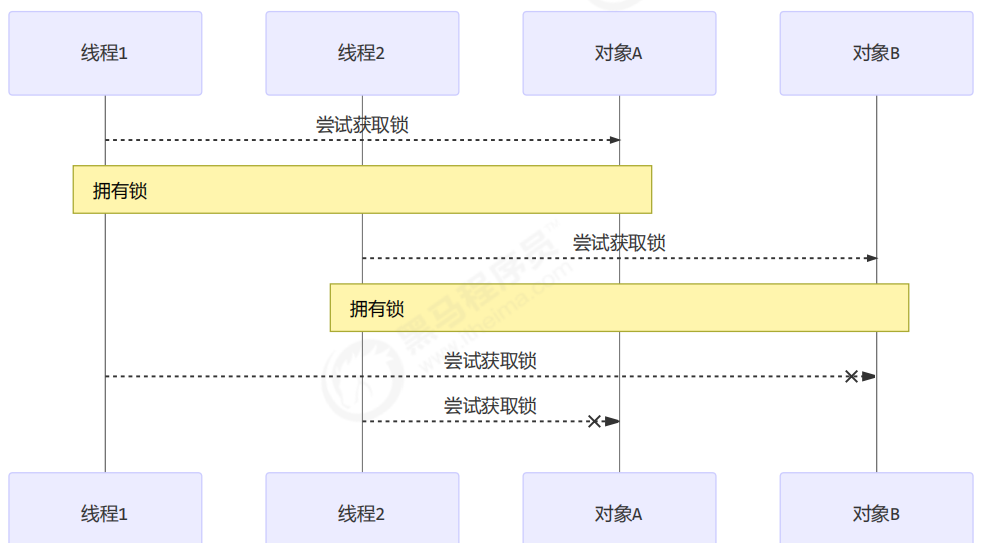

# :lock:Lock


## 重入锁


## 读写锁


## 多把锁

### 多把不相干的锁

一间大屋子有两个功能：睡觉、学习，互不相干。
现在小南要学习，小女要睡觉，但如果只用一间屋子（一个对象锁）的话，那么`并发度很低`。
解决方法是准备多个房间（多个对象锁）
例如

```java
class BigRoom {
    public void sleep() {
        synchronized (this) {
            log.debug("sleeping 2 小时");
            Sleeper.sleep(2);
        }
    }
    public void study() {
        synchronized (this) {
            log.debug("study 1 小时");
            Sleeper.sleep(1);
        }
    }
}
```

执行

```java
BigRoom bigRoom = new BigRoom();
new Thread(() -> {
 	bigRoom.compute();
},"小南").start();

new Thread(() -> {
 	bigRoom.sleep();
},"小女").start();
```

某次结果

```r
12:13:54.471 [小南] c.BigRoom - study 1 小时
12:13:55.476 [小女] c.BigRoom - sleeping 2 小时
```

改进

```java
class BigRoom {
    private final Object studyRoom = new Object();
    private final Object bedRoom = new Object();

    public void sleep() {
        synchronized (bedRoom) {
            log.debug("sleeping 2 小时");
            Sleeper.sleep(2);
        }
    }

    public void study() {
        synchronized (studyRoom) {
            log.debug("study 1 小时");
            Sleeper.sleep(1);
        }
    }
}
```

某次执行结果

```r
12:15:35.069 [小南] c.BigRoom - study 1 小时
12:15:35.069 [小女] c.BigRoom - sleeping 2 小时
```

将`锁的粒度`细分

```r
好处，是可以增强并发度
坏处，如果一个线程需要同时获得多把锁，就容易发生死锁
```

## 活跃性

### 死锁

前面我们说了，为了提高并发读，将一个粗粒度的锁变为多个细粒度的锁。这样的坏处就是会出现死锁。

```r
有这样的情况：一个线程需要同时获取多把锁，这时就容易发生死锁
t1线程 获得 A对象锁，接下来想获取 B对象的锁 
t2线程 获得 B对象锁，接下来想获取 A对象的锁
```

例：

```java
Object A = new Object();
Object B = new Object();
Thread t1 = new Thread(() -> {
    synchronized (A) {
        log.debug("lock A");
        sleep(1);	// sleep不会释放锁
        synchronized (B) {
            log.debug("lock B");
            log.debug("操作...");
        }
    }
}, "t1");
Thread t2 = new Thread(() -> {
    synchronized (B) {
        log.debug("lock B");
        sleep(0.5);
        synchronized (A) {
            log.debug("lock A");
            log.debug("操作...");
        }
    }
}, "t2");
t1.start();
t2.start();
```

结果

```r
12:22:06.962 [t2] c.TestDeadLock - lock B 
12:22:06.962 [t1] c.TestDeadLock - lock A
```

### 定位死锁

检测死锁可以使用` jconsole`工具，或者使用 `jps` 定位进程 id，再用` jstack` 定位死锁：

```ruby
cmd > jps
Picked up JAVA_TOOL_OPTIONS: -Dfile.encoding=UTF-8
12320 Jps
22816 KotlinCompileDaemon
33200 TestDeadLock // JVM 进程
11508 Main
28468 Launcher
```

```ruby
cmd > jstack 33200
Picked up JAVA_TOOL_OPTIONS: -Dfile.encoding=UTF-8
2018-12-29 05:51:40
Full thread dump Java HotSpot(TM) 64-Bit Server VM (25.91-b14 mixed mode):
    
"DestroyJavaVM" #13 prio=5 os_prio=0 tid=0x0000000003525000 nid=0x2f60 waiting on condition 
[0x0000000000000000]
	java.lang.Thread.State: RUNNABLE

"Thread-1" #12 prio=5 os_prio=0 tid=0x000000001eb69000 nid=0xd40 waiting for monitor entry 
    [0x000000001f54f000]
     java.lang.Thread.State: BLOCKED (on object monitor)
         at thread.TestDeadLock.lambda$main$1(TestDeadLock.java:28)
         - waiting to lock <0x000000076b5bf1c0> (a java.lang.Object)
         - locked <0x000000076b5bf1d0> (a java.lang.Object)
         at thread.TestDeadLock$$Lambda$2/883049899.run(Unknown Source)
         at java.lang.Thread.run(Thread.java:745)
"Thread-0" #11 prio=5 os_prio=0 tid=0x000000001eb68800 nid=0x1b28 waiting for monitor entry 
[0x000000001f44f000]
	java.lang.Thread.State: BLOCKED (on object monitor)
		at thread.TestDeadLock.lambda$main$0(TestDeadLock.java:15)
			- waiting to lock <0x000000076b5bf1d0> (a java.lang.Object)
            - locked <0x000000076b5bf1c0> (a java.lang.Object)
             at thread.TestDeadLock$$Lambda$1/495053715.run(Unknown Source)
             at java.lang.Thread.run(Thread.java:745)
// 略去部分输出
Found one Java-level deadlock:
=============================
"Thread-1":
 	waiting to lock monitor 0x000000000361d378 (object 0x000000076b5bf1c0, a java.lang.Object),
 	which is held by "Thread-0"
"Thread-0":
     waiting to lock monitor 0x000000000361e768 (object 0x000000076b5bf1d0, a java.lang.Object),
     which is held by "Thread-1"
Java stack information for the threads listed above:
===================================================
"Thread-1":
     at thread.TestDeadLock.lambda$main$1(TestDeadLock.java:28)
     - waiting to lock <0x000000076b5bf1c0> (a java.lang.Object)
     - locked <0x000000076b5bf1d0> (a java.lang.Object)
     at thread.TestDeadLock$$Lambda$2/883049899.run(Unknown Source)
     at java.lang.Thread.run(Thread.java:745)
"Thread-0":
     at thread.TestDeadLock.lambda$main$0(TestDeadLock.java:15)
     - waiting to lock <0x000000076b5bf1d0> (a java.lang.Object)
     - locked <0x000000076b5bf1c0> (a java.lang.Object)
     at thread.TestDeadLock$$Lambda$1/495053715.run(Unknown Source)
     at java.lang.Thread.run(Thread.java:745)
Found 1 deadlock.
```

```r
避免死锁要注意加锁顺序
另外如果由于某个线程进入了死循环，导致其它线程一直等待，对于这种情况 linux 下可以通过 top 先定位到
CPU 占用高的 Java 进程，再利用 top -Hp 进程id 来定位是哪个线程，最后再用 jstack 排查
```

### 哲学家就餐问题

### 活锁

### 饥饿

```r
很多教程中把饥饿定义为，一个线程由于优先级太低，始终得不到 CPU 调度执行，也不能够结束，饥饿的情况不
易演示，讲读写锁时会涉及饥饿问题
下面我讲一下我遇到的一个线程饥饿的例子，先来看看使用顺序加锁的方式解决之前的死锁问题
```



顺序加锁的解决方案

