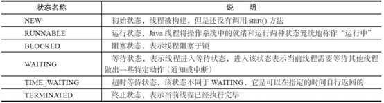
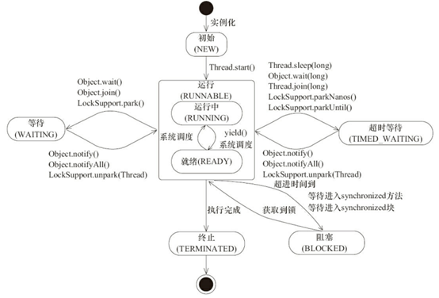

## 进程、线程

进程是资源分配的最小单位

线程是调度的最小单位

```markdown
1. 进程基本上相互独立的，而线程存在于进程内，是进程的一个子集。
2. 进程拥有共享的资源，如内存空间等，供其内部的。
3. 线程共享的进程间通信较为复杂。
	（1）同一台计算机的进程通信称为IPC (Inter-process communication)
	（2）不同计算机之间的进程通信，需要通过网络，并遵守共同的协议，例如HTTP。
4. 线程通信相对简单，只要线程能够读写同一个数据即可。因为它们共享进程内的内存，一个例子是多个线程可以访问同一个共享变量线程更轻量，线程上下文切换成本一般上要比进程上下文切换低。
```

## 并发、并行

```markdown
并发：同一时间段，多个任务都在执行 （单位时间内不一定同时执行，注意是“不一定”，因为有多核CPU存在）；
	高并发请求就是一个时间段内，有大量的请求进来，前后差距可能是几微妙，人类无法差距。但这种差距绝非并行。
并行：单位时间内，多个任务同时执行。

单核只能并发，多核才能并行！
```


## 同步、异步

```markdown
以调用方角度来讲，如果
（1）需要等待结果返回，才能继续运行就是同步
（2）不需要等待结果返回，就能继续运行就是异步
注意：同步在多线程中还有另外一层意思，是让多个线程步调一致
1、设计
多线程可以让方法执行变为异步的(即不要巴巴干等着)比如说读取磁盘文件时，假设读取操作花费了5秒钟，如果没有线程调度机制，这5秒cpu什么都做不了，其它代码都得暂停...
2、结论
（1）比如在项目中，视频文件需要转换格式等操作比较费时，这时开一个新线程处理视频转换，避免阻塞主线程。
（2）tomcat 的异步servlet 也是类似的目的，让用户线程处理耗时较长的操作，避免阻塞tomcat的工作线程。
（3）ui程序中，开线程进行其他操作，避免阻塞ui线程。
```

## 上下文切换

多线程编程中一般线程的个数都大于 CPU 核心的个数，而一个 CPU 核心在任意时刻只能被一个线程使用，为了让这些线程都能得到有效执行，CPU采取的策略（操作系统的任务调度器来完成）是为每个线程分配时间片并轮转的形式。当一个线程的时间片用完的时候就会重新处于就绪状态让给其他线程使用，这个过程就属于一次上下文切换。
概括来说就是：当前任务在执行完CPU时间片切换到另一个任务之前会先保存自己的状态，以便下次再切换回这个任务时，可以再加载这个任务的状态。任务从保存到再加载的过程就是一次上下文切换。
上下文切换通常是计算密集型的。也就是说，它需要相当可观的处理器时间，在每秒几十上百次的切换中，每次切换都需要纳秒量级的时间。所以，上下文切换对系统来说意味着消耗大量的CPU时间，事实上，可能是操作系统中时间消耗最大的操作。
Linux相比与其他操作系统（包括其他类Unix系统）有很多的优点，其中有一项就是，其上下文切换和模式切换的时间消耗非常少。

## 线程的状态

Java 线程在运行的生命周期中的指定时刻只可能处于下面6种不同状态的其中一个状态。





## 死锁

