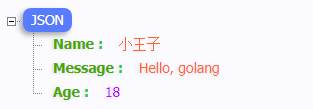

七米：https://www.bilibili.com/video/BV1gJ411p7xC

# Web本质

创建项目


```
https://goproxy.cn
```


`go.mod`保存了项目所有依赖信息


新建main文件

> 标准库：https://studygolang.com/pkgdoc

```go
package main

import (
	"fmt"
	"net/http"
)

// web开发就是一个请求对应一个响应
func sayHello(w http.ResponseWriter, r *http.Request) {
	_, _ = fmt.Fprintln(w, "<h1>Hello, Golang!</h1>")
}

func main() {
	http.HandleFunc("/hello", sayHello)
	err := http.ListenAndServe("127.0.0.1:9090", nil)
	if err != nil {
		fmt.Println("http serve failed, err:%v\n", err)
		return
	}
}
```


上面的<h1>Hello, Golang!</h1>是硬编码的

我们可以写到一个`hello.txt`文件中

```
<h1 style='color:orange'>Hello, Golang!</h1>
<h3>how are you?</h3>

<button id='b1'>点我</button>
<script>
document.getElementById('b1').onclick=function(){
    document.getElementById('i1').src='http://5b0988e595225.cdn.sohucs.com/images/20180920/c602cfd358a8466294d381296a6e15e7.jpeg'
}
</script>
```


```go
func sayHello(w http.ResponseWriter, r *http.Request) {
	b, _ := ioutil.ReadFile("./hello.txt")
	_, _ = fmt.Fprintln(w, string(b))
}
```

# Gin框架

官网：https://gin-gonic.com/

文档：https://gin-gonic.com/docs/

## Gin初识

下载安装

```
go get -u github.com/gin-gonic/gin
```

示例

```go
package main

import (
	"github.com/gin-gonic/gin"
)

func main() {
	r := gin.Default() // 返回默认的路由引擎

	// 指定用户使用GET请求访问/hello时，执行sayHello这个函数
	r.GET("/hello", sayHello)

	// 启动服务，默认为8080
	r.Run(":9090")	
}

func sayHello(c *gin.Context) {
	c.JSON(200, gin.H{
		"message": "Hello golang",
	})
}
```

> 顺便下载json-handle插件：http://jsonhandle.sinaapp.com/

RESTful风格

```go
// 不适用RESTful风格
r.GET("/create_book", ...)
r.GET("/update_book", ...)

r.GET("/remove_book", ...)	// 有的人删除
r.GET("/delete_book", ...)	// 有的人删除
r.GET("/shanchu_book", ...)	// 有的人删除

// 使用RESTful风格
r.GET("book", ...)
r.POST("book", ...)
r.PUT("book", ...)
r.DELETE("book", ...)
```

使用Postman

```go
package main

import (
	"github.com/gin-gonic/gin"
	"net/http"
)

func main() {
	r := gin.Default() // 返回默认的路由引擎

	// 指定用户使用GET请求访问/hello时，执行sayHello这个函数
	r.GET("/hello", sayHello)

	r.GET("/book", func(c *gin.Context) {
		c.JSON(200, gin.H{
			"method": "GET",
		})
	})

	r.POST("/book", func(c *gin.Context) {
		c.JSON(http.StatusOK, gin.H{
			"method": "POST",
		})
	})

	r.PUT("/book", func(c *gin.Context) {
		c.JSON(http.StatusOK, gin.H{
			"method": "PUT",
		})
	})
	r.DELETE("/book", func(c *gin.Context) {
		c.JSON(http.StatusOK, gin.H{
			"method": "DELETE",
		})
	})

	// 启动服务，默认为8080
	r.Run(":9090")
}

func sayHello(c *gin.Context) {
	c.JSON(200, gin.H{
		"message": "Hello golang",
	})
}
```

修改下图红色框，Send


## 模板

### template初识

新建项目

定义模板，新建`hello.tmpl`


`{{ . }}`

模板语法都包含在`{{ 和 }}`中间，其中` {{.}} `中的点表示当前对象。

定义模板

```html
<!doctype html>
<html lang="en">
<head>
    <meta charset="UTF-8">
    <meta name="viewport"
          content="width=device-width, user-scalable=no, initial-scale=1.0, maximum-scale=1.0, minimum-scale=1.0">
    <meta http-equiv="X-UA-Compatible" content="ie=edge">
    <title>Document</title>
</head>
<body>
    <p>hello, {{ . }} </p>
</body>
</html>
```


新建`main.go`

```go
package main

import (
	"fmt"
	"html/template"
	"net/http"
)

func main() {
	http.HandleFunc("/", sayHello)
	err := http.ListenAndServe(":9090", nil)
	if err != nil {
		fmt.Println("http server start failed, err:%v", err)
		return
	}
}

func sayHello(w http.ResponseWriter, r *http.Request) {
    // 1. 定义模板
	// 2. 解析模板
	t, err := template.ParseFiles("./hello.tmpl")		// 请勿刻舟求剑
	if err != nil {
		fmt.Println("Parse template failed, err:%v", err)
		return 
	}
	// 3. 渲染模板
	name := "小王子"
	err = t.Execute(w, name)
	if err != nil {
		fmt.Println("render template failed, err:%v", err)
		return
	}
}
```


```
go build
执行.exe
```


### go模板详解

`hello.tmpl`

```go
<!doctype html>
<html lang="en">
<head>
    <meta charset="UTF-8">
    <meta name="viewport"
          content="width=device-width, user-scalable=no, initial-scale=1.0, maximum-scale=1.0, minimum-scale=1.0">
    <meta http-equiv="X-UA-Compatible" content="ie=edge">
    <title>Document</title>
</head>
<body>
    <p>hello, {{ .Name }} </p>
    <p>年龄： {{ .Age }}</p>
    <p>性别： {{ .gender }}</p>
</body>
</html>
```

> 这里的.gender没有用的，因为小写是私有

结构体

```go
package main

import (
	"fmt"
	"html/template"
	"net/http"
)

type User struct {
	Name string
	gender string
	Age string
}

func main() {
	http.HandleFunc("/", sayHello)
	err := http.ListenAndServe(":9090", nil)
	if err != nil {
		fmt.Println("http server start failed, err:%v", err)
		return
	}
}

func sayHello(w http.ResponseWriter, r *http.Request) {
	// 2. 解析模板
	t, err := template.ParseFiles("./hello.tmpl")		// 请勿刻舟求剑
	if err != nil {
		fmt.Println("Parse template failed, err:%v", err)
		return 
	}
	// 3. 渲染模板
	u1 := User{
		Name:	"小王子",
		gender: "男",
		Age: "18",
	}
	name := u1
	err = t.Execute(w, name)
	if err != nil {
		fmt.Println("render template failed, err:%v", err)
		return
	}
}
```


### Gin框架模板渲染

```
模板定义

模板解析

模板渲染
```


`模板定义`	index.temp

```html
<!doctype html>
<html lang="en">
<head>
    <meta charset="UTF-8">
    <meta name="viewport"
          content="width=device-width, user-scalable=no, initial-scale=1.0, maximum-scale=1.0, minimum-scale=1.0">
    <meta http-equiv="X-UA-Compatible" content="ie=edge">
    <title>Document</title>
</head>
<body>
{{ .tittle }}

</body>
</html>
```

main.go

```go
package main

import (
	"github.com/gin-gonic/gin"
	"net/http"
)

func main() {
	r := gin.Default()
	r.LoadHTMLFiles("templates/index.temp")	// 2. 模板解析
	r.GET("/index", func(c *gin.Context) {
		c.HTML(http.StatusOK, "index.temp", gin.H{	// 3. 模板渲染
			"tittle": "glong.io",
		})
	})
	r.Run(":8080")	// 启动server
}
```

```
go build 
.exe
```

访问：http://127.0.0.1:8080/index

如果templates有多个文件夹，每个index.tmpl前后加上

```go
{{define "posts/index.temp"}}
<!doctype html>
<html lang="en">
<head>
    <meta charset="UTF-8">
    <meta name="viewport"
          content="width=device-width, user-scalable=no, initial-scale=1.0, maximum-scale=1.0, minimum-scale=1.0">
    <meta http-equiv="X-UA-Compatible" content="ie=edge">
    <title>Document</title>
</head>
<body>
{{ .tittle }}
</body>
</html>
{{end}}
```


```go
package main

import (
	"github.com/gin-gonic/gin"
	"net/http"
)

func main() {
	r := gin.Default()
	//r.LoadHTMLFiles("templates/index.temp")	// 2. 模板解析
	r.LoadHTMLGlob("templates/**/*")		// 通配符  **表示目录 ， *表示文件
	r.GET("/posts/index", func(c *gin.Context) {
		// HTTP请求
		c.HTML(http.StatusOK, "posts/index.temp", gin.H{	// 3. 模板渲染
			"tittle": "glong.io",
		})
	})

	r.GET("/users/index", func(c *gin.Context) {
		// HTTP请求
		c.HTML(http.StatusOK, "users/index.temp", gin.H{	// 3. 模板渲染
			"tittle": "users/glong.io",
		})
	})
	r.Run(":8080")	// 启动server
}
```


## 前后端分离

### gin框架返回json

> Json-Handle插件：http://jsonhandle.sinaapp.com/

```go
package main

import (
	"github.com/gin-gonic/gin"
	"net/http"
)

func main(){
	r := gin.Default()

	r.GET("/json", func(c *gin.Context) {
		// 方法1：使用map

		//data := map[string]interface{}{
		//	"name": "小王子",
		//	"message": "hello,world",
		//	"age": 18,
		//}

		// 方法2： H底层还是map
		data := gin.H{
			"name": "小王子",
			"message": "hello,world",
			"age": 18,
		}

		c.JSON(http.StatusOK, data)
	})

	// 方法3： 结构体，项目中用的多
   
	type msg struct{
        Name string `json:"name"` // `json:"name"`传小写给前端
		Message string
		Age int
	}

	r.GET("/another_json", func(c *gin.Context) {
		data := msg{
			"小王子",
			"Hello, golang",
			18,
		}
		c.JSON(http.StatusOK, data)
	})

	r.Run(":9090")
}
```

访问：http://localhost:9090/json

http://localhost:9090/another_json





### gin获取querystring参数