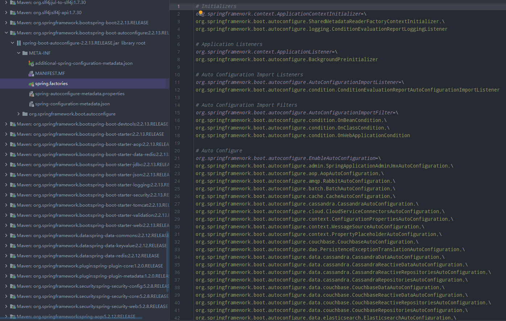

# SpringBoot核心配置

## Banner图标

在搭建Spring Boot项目环境时，程序启动后会在控制台打印醒目的SpringBoot图标，图标描述了Spring Boot版本信息，这是Spring Boot项目与Spring项目启动区别较大的地方，SpringBoot通过默认Banner在程序启动时显示应用启动图标，当然图标我们也可以进行自定义。

### 自定义

src/resurce/banner.txt，没有就是默认的


### 关闭Banner图标

如果不想看到Banner图标，在主启动类上添加

```java
SpringApplication springApplication = new SpringApplication(xxx.class);

springApplication.setBannerMode(Banner.Mode.OFF);

springApplication.run();
```


# 配置文件

Spring Boot默认会读取全局配置文件，配置文件名固定为: `application.properties` 或`application.yml`，放置在`src/main/resources`资源目录下，使用配置文件来修改SpringBoot自动配置的默认值。


## Starter坐标&自动化配置

### Starter坐标

Spring Boot引入了`全新的Starter坐标体系`，简化企业项目开发大部分场景的Starter pom，应用程序引入指定场景的Start pom相关配置就可以消除，通过Spring Boot就可以得到自动配置的Bean。

> 注：SpringBoot也支持传统的Maven坐标

#### Web starter

使用Spring MVC来构建RESTful Web应用，并使用Tomcat作为默认内嵌容器

```xml
<dependency>
    <groupId>org.springframework.boot</groupId>
    <artifactId>spring-boot-starter</artifactId>
</dependency>
```

#### security

只要在spring-boot-starter后面加入security

```xml
<dependency>
    <groupId>org.springframework.boot</groupId>
    <artifactId>spring-boot-starter-security</artifactId>
</dependency>
```

#### redis 缓存操作

只要在spring-boot-starter后面加入securitydata-redis

```xml
<dependency>
    <groupId>org.springframework.boot</groupId>
    <artifactId>spring-boot-starter-data-redis</artifactId>
</dependency>
```


## 自动化配置

### SpringBoot Starter坐标版本查看

上面介绍了SpringBoot Starter相关坐标，引入Starter坐标来简化应用环境的配置。这里以环境搭建spring-boot-starter-web坐标来简单分析SpringBoot自动化配置过程。

```xml
<!-- SpringBoot Web容器 -->
<dependency>
    <groupId>org.springframework.boot</groupId>
    <artifactId>spring-boot-starter-web</artifactId>
</dependency>
```

这里引入的web环境坐标不像传统的Maven坐标那样包含`坐标的版本号`，项目中引入的starter系列坐标对应的版本库统一由`父工程`坐标控制即项目中引入的`parent标签`。

```xml
<parent>
    <groupId>org.springframework.boot</groupId>
    <artifactId>spring-boot-starter-parent</artifactId>
    <!--	父类项目统一对项目依赖版本统一控制!	-->
    <version>2.2.2.RELEASE</version>
</parent>
```

这里spring-boot-starter-parent继承spring-boot-dependencies项目，在spring-boot-dependencies项目中定义了spring-boot-starter-web坐标的版本！(spring-boot-dependencies项目中定义了当前SpringBoot版本下各个starter坐标版本以及依赖的其他坐标版本)


### Spring Boot自动化配置

Spring Boot的项目一般都会有*Application 的入口类，入口类中提供main方法，这是一个标准的Java应用程序的入口方法。`@SpringBootApplication `注解是Spring Boot的`核心注解`，它其实是一个`组合注解`。

#### @SpringBootApplication

```java
@Target(ElementType.TYPE)
@Retention(RetentionPolicy.RUNTIME)
@Documented
@Inherited
@SpringBootConfiguration
@EnableAutoConfiguration
@ComponentScan(excludeFilters = { @Filter(type = FilterType.CUSTOM, classes = TypeExcludeFilter.class),
		@Filter(type = FilterType.CUSTOM, classes = AutoConfigurationExcludeFilter.class) })
public @interface SpringBootApplication {
    ...
}
```

可以看出该注解也是一个组合注解，组合了@Configuration 注解，对于Spring Boot应用,
`@SpringBootConfiguration`注解属于Spring Boot项目的配置注解也是属于一个`组合注解`, Spring Boot项目中推荐使用@SpringBootConfiguration注解，因为其组合了@Configuration注解。

#### @EnableAutoConfiguration

```java
@Target(ElementType.TYPE)
@Retention(RetentionPolicy.RUNTIME)
@Documented
@Inherited
@AutoConfigurationPackage
@Import(AutoConfigurationImportSelector.class)
public @interface EnableAutoConfiguration {
	...
}
```

`@EnableAutoConfiguration`注解组合了`@AutoConfigurationPackage`、`@Import(AutoConfigurationImportSelector.class)`注解。

`@AutoConfigurationPackage`底层也是一个`@Import(AutoConfigurationPackages.Registrarcass)`，其会把启动类
的包下组件都扫描到Spring容器中。

#### @AutoConfigurationPackage

```java
@Target(ElementType.TYPE)
@Retention(RetentionPolicy.RUNTIME)
@Documented
@Inherited
@Import(AutoConfigurationPackages.Registrar.class)
public @interface AutoConfigurationPackage {

}
```

`@Impor(AutoConfigurationlmportSelector.class)`自动配置的核心类AutoConfigurationlmportSelector.class，该类导入大量的自动配置类，debug可以发现，其读取的是classpath下的`META-INF/spring.factories`下配置文件。



以 WebMvcAutoConfiguration 为例，可以看出该类使用 @Configuration 注解进行标注其为一个配置类。

```java
@Configuration(proxyBeanMethods = false)
@ConditionalOnWebApplication(type = Type.SERVLET)
@ConditionalOnClass({ Servlet.class, DispatcherServlet.class, WebMvcConfigurer.class })
@ConditionalOnMissingBean(WebMvcConfigurationSupport.class)
@AutoConfigureOrder(Ordered.HIGHEST_PRECEDENCE + 10)
@AutoConfigureAfter({ DispatcherServletAutoConfiguration.class, TaskExecutionAutoConfiguration.class,
		ValidationAutoConfiguration.class })
public class WebMvcAutoConfiguration {
	...
}
```

当然 spring.factories 文件中配置类默认不会都生效，具体哪些配置类生效由配置类上标注的`@ConditionalOnClass`注解来决定，这里了解下@ConditionalOnClass注解含义。

```java
@ConditionalOnBean			//当给定的在bean存在时,则实例化当前Bean
@ConditionalOnMissingBean	// 当给定的在bean不存在时，则实例化当前Bean
@ConditionalOnClass			//当给定的类名在类路径上存在，则实例化当前Bean
@ConditionalOnMissingClass	// 当给定的类名在类路径上不存在，则实例化当前Bean
```


意味着 WebMvCAutoConfiguration 配置类生效需要环境中存在Servlet.class，DispatcherServlet.class，WebMecConfigurer.class实例，配置类才会生效。

从以上分析可以得出如下结论：

```markdown
Spring Boot 通过 maven 中的 starter 导入了所需场景下的 jar 包，并通过主启动类上的
@SpringBootApplication中的 @EnableAutoConfiguration 读取了类路径下的META-
INF/spring.factories 下 EnableAutoConfiguration 的配置类，这些配置类使用@ConditionalOnClass来标注，根据 @Conditional0nClass 标注的约束条件来引入自动化的环境配置。
```

