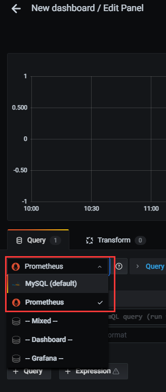
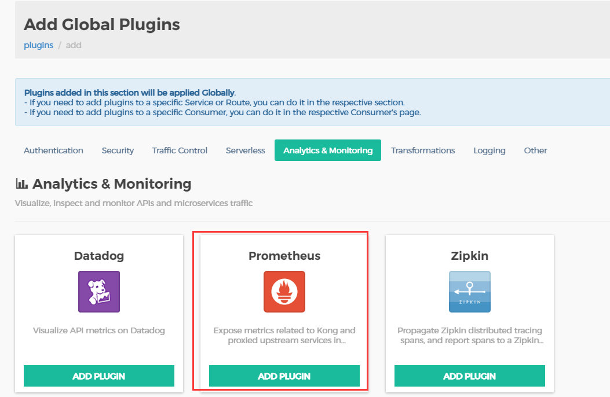

# Kong

教程

https://blog.csdn.net/cry1049208942/article/details/105971198

https://www.jianshu.com/p/54d49faecce3

https://www.jianshu.com/p/9ff063b1f4c6

## 运行 kong

### 创建子网

```bash
docker network create kong-net
```

### 运行数据库

#### 创建postgersql数据库

```bash
docker run -d --name kong-database \
               --network=kong-net \
               -p 5432:5432 \
               -e "POSTGRES_USER=kong" \
               -e "POSTGRES_DB=kong" \
               -e "POSTGRES_PASSWORD=kong" \
               postgres:9.6
```

#### 数据库迁移

```bash
docker run --rm \
     --network=kong-net \
     -e "KONG_DATABASE=postgres" \
     -e "KONG_PG_HOST=kong-database" \
     -e "KONG_PG_PASSWORD=kong" \
     -e "KONG_CASSANDRA_CONTACT_POINTS=kong-database" \
     kong:1.5 kong migrations bootstrap
```

### 运行 kong

```bash
docker run -d --name kong \
     --network=kong-net \
     -e "KONG_DATABASE=postgres" \
     -e "KONG_PG_HOST=kong-database" \
     -e "KONG_PG_PASSWORD=kong" \
     -e "KONG_CASSANDRA_CONTACT_POINTS=kong-database" \
     -e "KONG_PROXY_ACCESS_LOG=/dev/stdout" \
     -e "KONG_ADMIN_ACCESS_LOG=/dev/stdout" \
     -e "KONG_PROXY_ERROR_LOG=/dev/stderr" \
     -e "KONG_ADMIN_ERROR_LOG=/dev/stderr" \
     -e "KONG_ADMIN_LISTEN=0.0.0.0:8001, 0.0.0.0:8444 ssl" \
     -p 8000:8000 \
     -p 8443:8443 \
     -p 8001:8001 \
     -p 8444:8444 \
     kong:1.5
```

### 运行 kong gui

#### 运行 kong-dashboard~

> 建议直接跳过，dashboard 可以运行，但是前端尽是报错，github上面的issue也没人处理，应该是不维护了。

```bash
docker run  --network=kong-net \
            --name kong-dashboard \
            -p 8080:8080 \
            -d pgbi/kong-dashboard \
            start --kong-url http://kong:8001 \
            --basic-auth user1=password1 
```

#### 运行 konga（kong可视化管理工具）

```bash
docker pull pantsel/konga

docker run -d \
-p 1337:1337 \
--network kong-net \
-e "TOKEN_SECRET=kongtoken" \
-e "DB_ADAPTER=postgres" \
-e "DB_HOST=kong-database" \
-e "DB_USER=kong"  \
-e "DB_PASSWORD=kong" \
 --name konga \
pantsel/konga
```

访问：http://192.168.28.118:1337/

#### 完成

配置 Kong's admin API的连接，然后激活此链接，炫酷的面板，大吉大利！！！

```
192.168.28.118:8001
```


## 服务使用

博客：https://www.cnblogs.com/bhfdz/p/14303309.html

视频：[Rainbond 与 Kong API-Gateway 实践](https://www.bilibili.com/video/BV1zz411q7m7?from=search&seid=9381355276042576626)

### 1.添加服务

```shell
curl -i -X POST http://192.168.28.118:8001/services \
     --data name=example_service \
     --data url='http://mockbin.org'
```

[http://mockbin.org](http://mockbin.org/) ，点进入你就知道是干啥的了！以下验证此服务

```shell
curl -i http://192.168.28.118:8001/services/example_service
```

### 2.添加路由

```shell
curl -i -X POST http://192.168.28.118:8001/services/example_service/routes \
--data 'paths[]=/mock' \
 --data 'name=mocking'
```


以下验证此服务

```shell
curl -i -X GET http://192.168.28.118:8000/mock
```

### 3.添加限流

```shell
curl -i -X POST http://192.168.28.118:8001/plugins \
--data "name=rate-limiting" \
--data "config.minute=5" \
--data "config.policy=local"
```

以下验证此服务，每分钟只能请求5次

```shell
curl -i -X GET http://192.168.28.118:8000/mock/request
```

超过5次，

```json
{
  "message":"API rate limit exceeded"
}
```

如下图


### 4.代理缓存

```shell
curl -i -X POST http://192.168.28.118:8001/plugins \
--data name=proxy-cache \
--data config.content_type="application/json" \
--data config.cache_ttl=30 \
--data config.strategy=memory
```

注意抓取请求头的变化（与教程有点出入，不太好使！）

```shell
curl -i -X GET http://192.168.28.118:8000/mock/request
```

删除缓存

```shell
curl -i -X DELETE http://192.168.28.118:8001/proxy-cache
```

### 5.身份验证

```shell
curl -X POST http://192.168.28.118:8001/routes/mocking/plugins \
--data name=key-auth
```

再次访问服务，HTTP/1.1 401 Unauthorized


设置使用者

```shell
curl -i -X POST -d "username=consumer&custom_id=consumer" http://192.168.28.118:8001/consumers/
```

创建凭据，对于此示例，将密钥设置为apikey。如果未输入任何密钥，则Kong将自动生成密钥。

```shell
curl -i -X POST http://192.168.28.118:8001/consumers/consumer/key-auth -d 'key=apikey'
```

返回结果如下：

```json
{
	"created_at": 1611110699,
	"id": "6695bd72-16e6-490d-b983-c141c39b5da8",
	"tags": null,
	"ttl": null,
	"key": "apikey",
	"consumer": {
		"id": "cbdec9e6-70aa-4166-9289-e1fe5737ab6e"
	}
}
```

再次访问服务，返回正常

```shell
curl -i http://192.168.28.118:8000/mock/request -H 'apikey:apikey'
```

### 6.禁用插件（可选）

```shell
curl -X GET http://192.168.28.118:8001/routes/mocking/plugins/
```

以下是返回的数据

```json
{
	"next": null,
	"data": [{
		"created_at": 1611109944,
		"id": "e488b6e6-6183-499c-b430-0aa676245ee5",
		"tags": null,
		"enabled": true,
		"protocols": ["grpc", "grpcs", "http", "https"],
		"name": "key-auth",
		"consumer": null,
		"service": null,
		"route": {
			"id": "ed6baf5a-5d32-4550-91d8-661fc3539e44"
		},
		"config": {
			"key_in_query": true,
			"key_names": ["apikey"],
			"key_in_header": true,
			"run_on_preflight": true,
			"anonymous": null,
			"hide_credentials": false,
			"key_in_body": false
		}
	}]
}
```

禁用此插件

```shell
curl -X PATCH http://192.168.28.118:8001/routes/mocking/plugins/e488b6e6-6183-499c-b430-0aa676245ee5 \
 --data "enabled=false"
```

### 7.负载均衡

配置上游服务

```shell
curl -X POST http://192.168.28.118:8001/upstreams \
 --data name=upstream
```

以前配置的服务指向上游

```shell
curl -X PATCH http://192.168.28.118:8001/services/example_service \
--data host='upstream'
```

向上游添加目标，***此处玩脱了容器卡住多次也不能添加成功***

```shell
curl -X POST http://192.168.28.118:8001/upstreams/upstream/targets \
--data target='mockbin.org:80'

curl -X POST http://192.168.28.118:8001/upstreams/upstream/targets \
--data target='httpbin.org:80'
```

浏览器中访问 http://192.168.28.118:8000/mock 进行验证


# 从0开始搭建Prometheus+Grafana

api 经过 kong，会留下日志，prometheus 通过 `8001` 端点标准化采集的日志，
 `grafana` 通过 `prometheus `得到标准后的日志进行展示。


安装教程：https://www.yuque.com/markus/hon7gx/nedufb

使用教程！：https://www.cnblogs.com/guoxiangyue/p/11772717.html

## Prometheus

>中文普罗米修斯，全链路实时监控

下载：https://prometheus.io/download/

在tsingdata03的/opt/software

```
wget https://github.com/prometheus/prometheus/releases/download/v2.27.1/prometheus-2.27.1.linux-amd64.tar.gz
```


```
tar -zxvf prometheus-2.27.1.linux-amd64.tar.gz -C /opt/module/
```

启动

```
./prometheus --config.file=prometheus.yml &
```

访问：http://192.168.28.118:9090/


prometheus.yml 文件配置如下

```
cd /opt/module/prometheus
vim prometheus.yml
```


```yaml
# my global config
global:
  scrape_interval:     15s # Set the scrape interval to every 15 seconds. Default is every 1 minute.
  evaluation_interval: 15s # Evaluate rules every 15 seconds. The default is every 1 minute.
  # scrape_timeout is set to the global default (10s).

# Alertmanager configuration
alerting:
  alertmanagers:
  - static_configs:
    - targets:
      # - alertmanager:9093

# Load rules once and periodically evaluate them according to the global 'evaluation_interval'.
rule_files:
  # - "first_rules.yml"
  # - "second_rules.yml"

# A scrape configuration containing exactly one endpoint to scrape:
# Here it's Prometheus itself.
scrape_configs:
  # The job name is added as a label `job=<job_name>` to any timeseries scraped from this config.
  - job_name: 'prometheus'

    # metrics_path defaults to '/metrics'
    # scheme defaults to 'http'.

    static_configs:
    - targets: ['192.168.28.116:8001']

```

核心点就是上面的` targets`，相信很多分析类的文章都没有提到。

重新启动

```
./prometheus --config.file=prometheus.yml &
```


## Grafana


```
wget https://dl.grafana.com/oss/release/grafana-7.5.7-1.x86_64.rpm
sudo yum install grafana-7.5.7-1.x86_64.rpm
```

启动

```
sudo service grafana-server start 
```

使用下面命令检查是否启动成功

```
sudo service grafana-server status
```

访问：http://192.168.28.118:3000/

```
admin
admin
```


设置prometheus连接grafana


新建仪表盘




## Node_exporter

```
https://github.com/prometheus/node_exporter/releases/download/v1.1.2/node_exporter-1.1.2.linux-amd64.tar.gz
```


解压安装

```
tar -zxvf node_exporter-1.0.1.linux-amd64.tar.gz -C /opt/module/
```


改名

```
mv node_exporter-1.0.1.linux-amd64 node_exporter

cd node_exporter
```

启动服务

```
./node_exporter & 
```

如果一切顺利你会看到类似下面的输出，默认端口是`9100`

访问：http://192.168.28.118:9100/


将 node_exporter 服务加入到 Prometheus 的监控列表

```
cd /opt/module/prometheus
```

在 prometheus.yml 末尾添加如下内容，将IP地址换成你的 node_exporter 节点的实际地址即可。

```yml
- job_name: 'node'

   static_configs:

   - targets: ['192.168.28.118:9100']
```

```
./prometheus --config.file=prometheus.yml &
```

访问：http://192.168.28.118:9090/targets


## Dashboard

https://grafana.com/grafana/dashboards 

### 第一个模板

翻到下面


我这里就是下面这个数字

```
13105
```

或者下载JSON，可以不用


 然后打开我们的Grafana监控页面，打开dashboard的管理页面


 点击【import】按钮


 然后将我们刚才的复制的dashboard Id 复制进去


 Grafana会自动识别dashboard Id 。

然后点击【change】按钮，生成一个随机的UID，然后点击下方输入框，选择我们之前创建的数据源Prometheus，最后点击【Import】按钮，即可完成导入。


 导入成功后，会自动打开该Dashboard，即可看到我们刚才设置好的node监控


### 第二个模板

https://grafana.com/grafana/dashboards/8919

此模板需要配置，我们这边监控多台服务器，其他机器也需要操作node_exporter的步骤，需要让他们跑起来。

然后再配置

```yml
# my global config
global:
  scrape_interval:     15s # Set the scrape interval to every 15 seconds. Default is every 1 minute.
  evaluation_interval: 15s # Evaluate rules every 15 seconds. The default is every 1 minute.
  # scrape_timeout is set to the global default (10s).

# Alertmanager configuration
alerting:
  alertmanagers:
  - static_configs:
    - targets:
      # - alertmanager:9093

# Load rules once and periodically evaluate them according to the global 'evaluation_interval'.
rule_files:
  # - "first_rules.yml"
  # - "second_rules.yml"

# A scrape configuration containing exactly one endpoint to scrape:
# Here it's Prometheus itself.
scrape_configs:
  # The job name is added as a label `job=<job_name>` to any timeseries scraped from this config.
  - job_name: 'prometheus'

    # metrics_path defaults to '/metrics'
    # scheme defaults to 'http'.

    static_configs:
    - targets: ['192.168.28.118:8001']

  - job_name: 'node'
    static_configs:
    - targets: ['192.168.28.118:9100','192.168.28.117:9100','192.168.28.116:9100']
```


### 最重要的Kong模板:star:

参考：http://blog.sunqiang.me/2019/12/24/kong-%E4%BD%BF%E7%94%A8prometheusgrafana%E8%BF%9B%E8%A1%8C%E7%9B%91%E6%8E%A7/

在Konga安装Promethus模板

http://luarocks.org/modules/kong/kong-prometheus-plugin

#### 添加 Kong 数据信息

在Promethus上添加配置

```
- targets: ['192.168.28.118:9090','192.168.28.118:8001']
```

#### 在konga中添加Prometheus插件



#### 打开kong的metrics支持

http://192.168.28.118:8001/metrics


#### 在 Grafana 管理界面添加数据源

“Configuration” => “Add data source” => “Prometheus” => “select”

输入普罗米修斯的地址

http://192.168.28.118:9090

#### 添加官方 Dashboard

1、登录 Grafana 后，点击左边的 “+” => “Create” => “Import”。
2、输入 `7424` ，7424 是 Kong 官方提供的与 Prometheus 插件配套的 Dashboard。
3、完成，调用 Kong 网关接口即可查看数据。


# 使用FastAPI服务

启动fastapi服务

> 我这边设置的fastapi是跑在8848端口的

```
curl -i -X POST http://192.168.28.118:8001/services/FastAPI/routes \
--data 'paths[]=/fastapi' \
 --data 'name=fastapi'
```

访问

```
curl -i -X GET http://192.168.28.118:8000/docs
```

> 这里可以得到和直接访问8848一样的结果，只不过我们走了一遍网关，网关路由到了8848那边的服务。

现在可以使用Grafana来查看kong网关的情况，因为Prometheus那边会抓取kong的指数

