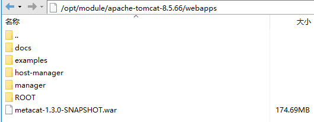

# 直接安装

后期通过下载hive源码并在IDEA中打开，修改配置并编译打包：

```
git clone https://gitee.com/mirrors/Metacat.git
cd Metacat
./gradlew clean build
```

然后将对应的包`Metacat/metacat-war/build/libs/metacat-1.3.0-SNAPSHOT.war`拷贝到对应的tomcat容器中，因为metacat是以war来打包的，需要依赖web容器运行；

下载tomcat并部署：

https://tomcat.apache.org/download-80.cgi下载tar.gz的linux版本

```
wget https://mirrors.bfsu.edu.cn/apache/tomcat/tomcat-8/v8.5.66/bin/apache-tomcat-8.5.66.tar.gz
```

解压后，将上一步中的war包拷贝`apache-tomcat-8.5.66/webapps`目录下，并改名为`ROOT.war`



然后启动 tomcat

```
#启动tomcat服务
./startup.sh
#停止tomcat服务
./shutdown.sh
```

# 编译安装

注释下面这段

```
@ConditionalOnProperty(value = "springfox.documentation.swagger-ui.enabled", havingValue = "true")
```

打成war包，路径与上面的一致

http://192.168.28.116:8080/swagger-ui/index.html#

> 注意端口号冲突问题

http://192.168.28.116:8080:8080/v3/api-docs

