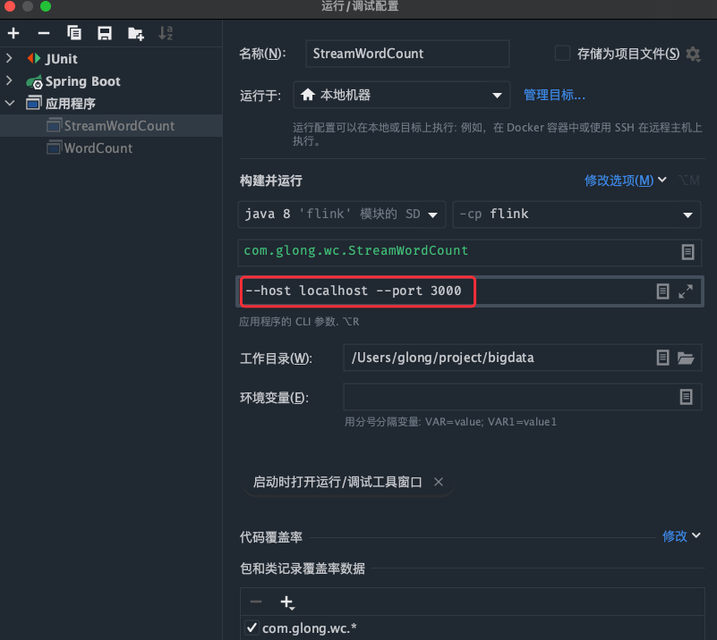

## Flink简单上手

### 批处理

创建maven项目，修改pom文件

添加依赖

```xml
    <dependencies>
        <dependency>
            <groupId>org.apache.flink</groupId>
            <artifactId>flink-java</artifactId>
            <version>1.10.3</version>
        </dependency>

        <dependency>
            <groupId>org.apache.flink</groupId>
            <artifactId>flink-streaming-java_2.12</artifactId>
            <version>1.10.3</version>
        </dependency>

        <dependency>
            <groupId>org.apache.flink</groupId>
            <artifactId>flink-clients_2.12</artifactId>
            <version>1.10.3</version>
        </dependency>
    </dependencies>
```

在Resource下面新建hello.txt

```
hello word
hello spark
hello scala
and you
```

新建WordCount类

```java
public class WordCount {

    public static void main(String[] args) throws Exception {
        // 创建环境

        ExecutionEnvironment env = ExecutionEnvironment.getExecutionEnvironment();

        // 文件路径
        String inputPath = "/Users/glong/project/bigdata/flink/src/main/resources/hello.txt";

        DataSource<String> inputDataSet = env.readTextFile(inputPath);

        // 对数据进行处理
        DataSet<Tuple2<String, Integer>> result = inputDataSet.flatMap(new MyFlatMapper())
                .groupBy(0) // 按照第一个位置对word分组
                .sum(1);// 将第二个位置上对数据求和

        result.print();
    }

  	// 上面的flatMap需要
    public static class MyFlatMapper implements FlatMapFunction<String, Tuple2<String, Integer>> {
        @Override
        public void flatMap(String value, Collector<Tuple2<String, Integer>> out) throws Exception {
            // 按照空格分词
            String[] words = value.split(" ");

            // 遍历，包成二元组输出
            for (String word : words) {
                out.collect(new Tuple2<>(word, 1));
            }
        }
    }
}
```

### 流处理

创建StreamWordCount

#### 从文件中读取数据

```java
public class StreamWordCount {
    public static void main(String[] args) throws Exception {
        // 创建流处理执行环境
        StreamExecutionEnvironment env = StreamExecutionEnvironment.getExecutionEnvironment();

        String inputPath = "/Users/glong/project/bigdata/flink/src/main/resources/hello.txt";

        DataStream<String> inputDataStream = env.readTextFile(inputPath);

        // 基于数据流进行转换操作
        SingleOutputStreamOperator<Tuple2<String, Integer>> result = inputDataStream.flatMap(new WordCount.MyFlatMapper())
                .keyBy(0)
                .sum(1);

        result.print();

        // 执行任务
        env.execute();
    }
}
```

结果

```bash
3> (hello,1)
1> (scala,1)
3> (hello,2)
1> (spark,1)
3> (hello,3)
6> (word,1)
5> (you,1)
8> (and,1)
```

这就是==有状态==的流处理，来一个处理一次。另外前面的数字是线程（默认是本地机器的线程），可以使用如下API修改

```java
env.setParallelism(4);
```

#### 从socket文本流读取数据

```java
public class StreamWordCount {
    public static void main(String[] args) throws Exception {
        // 创建流处理执行环境
        StreamExecutionEnvironment env = StreamExecutionEnvironment.getExecutionEnvironment();

        DataStream<String> inputDataStream = env.socketTextStream("localhost", 3000);

        // 基于数据流进行转换操作
        SingleOutputStreamOperator<Tuple2<String, Integer>> result = inputDataStream.flatMap(new WordCount.MyFlatMapper())
                .keyBy(0)
                .sum(1);

        // 打印结果
        result.print();

        // 执行任务
        env.execute();
    }
}

```

启动程序

打开Mac终端或者Windows的虚拟机

输入

```bash
nc -lk 3000
```


#### 离生产环境更近一步

不再将host和port写死，使用Flink提供的parameter tool

```java
// 用parameter tool工具从程序启动参数中提取配置项
ParameterTool parameterTool = ParameterTool.fromArgs(args);
        String host = parameterTool.get("host");
        int port = parameterTool.getInt("port");
```

在Run的编辑配置，添加参数



再次运行main程序，然后在终端打开并输入

```bash
nc lk 3000
```

```
hello world glong
```


## Flink部署

### Standlone模式

略

### Yarn模式

## Flink运行时架构


## Flink流处理API

### 执行环境


### Source

#### 集合

#### 文本

#### Kafka

引入官方依赖

```xml
<dependency> 
    <groupId>org.apache.flink</groupId> 
    <artifactId>flink-connector-kafka-0.11_2.12</artifactId> 
    <version>1.10.1</version>
</dependency>
```


```java
// kafka 配置项
Properties properties = new Properties();
properties.setProperty("bootstrap.servers", "localhost:9092");
properties.setProperty("group.id", "consumer-group");
properties.setProperty("key.deserializer","org.apache.kafka.common.serialization.StringDeserializer");
properties.setProperty("value.deserializer","org.apache.kafka.common.serialization.StringDeserializer");
properties.setProperty("auto.offset.reset", "latest");
// 从 kafka 读取数据
DataStream<String> dataStream = env.addSource( new FlinkKafkaConsumer011<String>("sensor", new SimpleStringSchema(), properties));
```


### Transform转换算子

Flink最重要的部分


### Sink

```java
addSink()	最通用
...
writeToSocket()
writeAsCsv()
```

官方提供的依赖

Kafka

```xml
<dependency> 
    <groupId>org.apache.flink</groupId> 
    <artifactId>flink-connector-kafka-0.11_2.12</artifactId> 
    <version>1.10.1</version>
</dependency>
```

将Kafka的一个topic（记为1）作为Flink的Source，Flink实时读取数据，然后Sink到Kafka的另一个topic（记为2）。

此时对topic1的生产者输入数据，那么topic2的消费者会得到数据。

Redis

```xml
<dependency> 
    <groupId>org.apache.bahir</groupId> 
    <artifactId>flink-connector-redis_2.11</artifactId> 
    <version>1.0</version>
</dependency>
```

