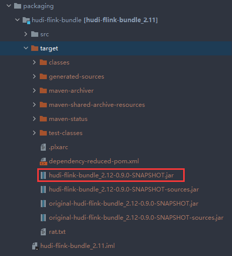

# Hudi安装

视频参考：https://www.bilibili.com/video/BV1fy4y1x7nH?from=search&seid=9178314101807252200

## 版本

```
0.8.0
```

## 安装环境准备

```
Hadoop 3.1.3集群
Hive   3.1.2
Flink  1.12.3
```

## Hudi编译

```
https://github.com/apache/hudi
```


```
cd /opt/module/
git clone https://hub.fastgit.org/apache/hudi.git && cd hudi
```

默认是用 scala-2.11 编译的 如果用的是 flink1.12.2-2.12 版本，可以自己编译成scala-2.12版本的。

window环境下注释掉

```xml
<module>hudi-integ-test</module>
<module>packaging/hudi-integ-test-bundle</module>
```

修改pom，添加

```xml
 <repository>
     <id>maven-ali</id>
     <url>http://maven.aliyun.com/nexus/content/groups/public//</url>
     <releases>
         <enabled>true</enabled>
     </releases>
     <snapshots>
         <enabled>true</enabled>
         <updatePolicy>always</updatePolicy>
         <checksumPolicy>fail</checksumPolicy>
     </snapshots>
</repository>
```

打包

```
mvn clean package -DskipTests -Dscala-2.12
```

包的路径在

```
packaging/hudi-flink-bundle/target/hudi-flink-bundle_2.12-0.9.0-SNAPSHOT.ja
```



# Flink和Hudi

参考：[重磅！解锁Apache Flink读写Apache Hudi新姿势](https://zhuanlan.zhihu.com/p/364026320)

下载 Flink 1.12.3 ：https://mirrors.tuna.tsinghua.edu.cn/apache/flink/


## Batch写

### 环境启动

启动` flink-sql `客户端，提前把 `hudi-flink-bundle_2.12-0.9.0-SNAPSHOT.jar`（我这里使用 flink scala 2.12 版本。）

如果是 scala2.11 版本需要编译成 `hudi-flink-bundle_2.12-0.9.0-SNAPSHOT.jar `拷贝到 $FLINK_HOME/lib 目录下

```
cd flink-1.12.3/

export HADOOP_CLASSPATH=`$HADOOP_HOME/bin/hadoop classpath`

# Start the flink standalone cluster
./bin/start-cluster.sh

export HADOOP_CLASSPATH=`$HADOOP_HOME/bin/hadoop classpath`
./bin/sql-client.sh embedded -j /opt/module/hudi-flink-bundle_2.12-0.9.0-SNAPSHOT.jar shell
```


### 创建表结构

```sql
CREATE TABLE t1(
  uuid VARCHAR(20),
  name VARCHAR(10),
  age INT,
  ts TIMESTAMP(3),
`partition` VARCHAR(20)
)
PARTITIONED BY (`partition`)
WITH (
'connector'= 'hudi',
'path'= 'hdfs://localhost:9000/hudi/t1',
'table.type'= 'MERGE_ON_READ'
);
```

###  插入数据

```sql
INSERT INTO t1 VALUES
('id1','Danny',23,TIMESTAMP '1970-01-01 00:00:01','par1'),
('id2','Stephen',33,TIMESTAMP '1970-01-01 00:00:02','par1'),
('id3','Julian',53,TIMESTAMP '1970-01-01 00:00:03','par2'),
('id4','Fabian',31,TIMESTAMP '1970-01-01 00:00:04','par2'),
('id5','Sophia',18,TIMESTAMP '1970-01-01 00:00:05','par3'),
('id6','Emma',20,TIMESTAMP '1970-01-01 00:00:06','par3'),
('id7','Bob',44,TIMESTAMP '1970-01-01 00:00:07','par4'),
('id8','Han',56,TIMESTAMP '1970-01-01 00:00:08','par4');
```


### 查询数据 

设置查询模式为tableau

```sql
-- sets up the result mode to tableau to show the results directly in the CLI
set execution.result-mode=tableau;
```


### 更新数据 

```sql
INSERT INTO t1 VALUES ('id1','Danny',24,TIMESTAMP '1970-01-01 00:00:01','par1');
```

id1的数据age由23变为了24


## Streaming读 

### 创建表结构

```sql
CREATE TABLE t1(
  uuid VARCHAR(20),
  name VARCHAR(10),
  age INT,
  ts TIMESTAMP(3),
`partition` VARCHAR(20)
)
PARTITIONED BY (`partition`)
WITH (
'connector'= 'hudi',
'path'= 'hdfs://localhost:9000/hudi/t1',
'table.type'= 'MERGE_ON_READ',
'read.streaming.enabled'= 'true',  
'read.streaming.start-commit'= '20210401134557',
'read.streaming.check-interval'= '4'
);
```

说明：这里将 `read.streaming.enabled` 设置为 true，表明通过 streaming 的方式读取表数据； `read.streaming.check-interval` 指定了 source 监控新的 commits 的间隔为 4s； `table.type` 设置表类型为 `MERGE_ON_READ`。

### 查询数据

流表t1表中的数据就是刚刚批模式写入的数据


### 插入数据 

使用批模式插入一条数据

```sql
insert into t1 values ('id9','test',27,TIMESTAMP '1970-01-01 00:00:01','par5');
```

### 查询数据

几秒后在流表中可以读取到一条新增的数据（前面插入的一条数据）


