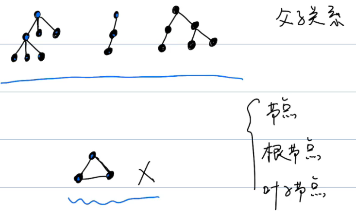
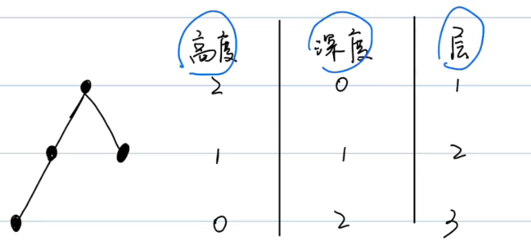
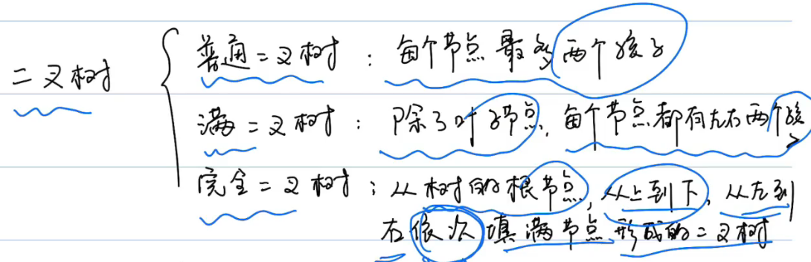
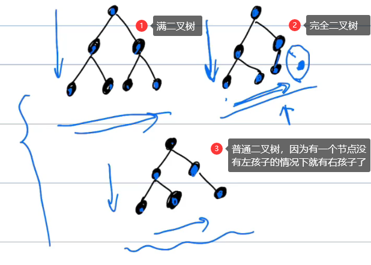
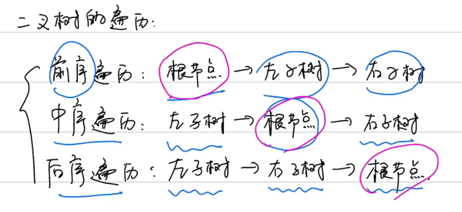
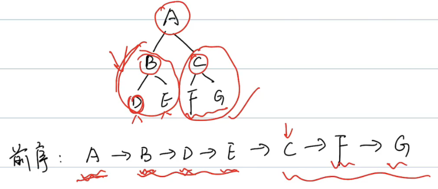
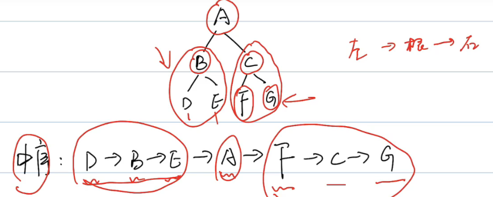
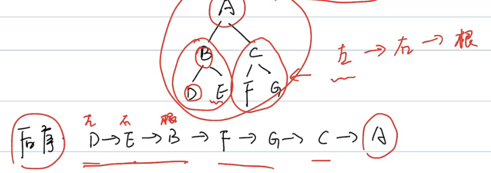

# 树

>前序遍历知道根
>
>中序遍历划分左子树，根，右子树



```markdown
节点：除了根节点和叶子节点外的节点
根节点：第一个开始的节点
叶子节点：最底层的节点，没有孩子
```



```markdown
深度：从上往下计算
高度：从下往上计算
层： 从上往下计算。1开始
```

## 二叉树





> 补充：
>
> - 满二叉树叶子节点必须在同一层。
>
> - 满二叉树一定是完全二叉树，但是完成二叉树不一定是满二叉树

二叉树遍历：

```markdown
1. 前序遍历：根左右
2. 中序遍历：左根右
3. 后续遍历：左右根
```

“序”是围绕根节点的。










## 树的常用操作

树在工作中一般自己单独使用的机会很少。

在刷题过程中，力扣会直接给你树的结构。


## 前缀树

匹配与前缀相同的字符串

复杂度

```
插入: O(N)
搜索: O(N)
前缀(prefix): O(N)
```

## 练习

### [剑指 Offer 07/LeetCode105. 重建二叉树](https://leetcode-cn.com/leetbook/read/illustration-of-algorithm/99lxci/)

在分而治之章节

### [剑指 Offer 26. 树的子结构](https://leetcode-cn.com/leetbook/read/illustration-of-algorithm/5dshwe/)

输入两棵二叉树A和B，判断B是不是A的子结构。(约定空树不是任意一个树的子结构)

B是A的子结构， 即 A中有出现和B相同的结构和节点值。

例如:
给定的树 A:

         3
        / \
       4   5
      / \
     1   2给定的树 B：
```
   4 
  /
 1
```

返回 true，因为 B 与 A 的一个子树拥有相同的结构和节点值。

示例 1：

```
输入：A = [1,2,3], B = [3,1]
输出：false
```

示例 2：

```
输入：A = [3,4,5,1,2], B = [4,1]
输出：true
```

限制：

- `0 <= 节点个数 <= 10000`

题解：

> 树的问题肯定用递归解决
>
> 根据条件，A和B一定不能为空

```java
class Solution {
    public boolean isSubStructure(TreeNode A, TreeNode B) {
      	// 递归方法
      	// 根据条件，A和B不为空
      	/**
      		然后分3个情况
      	 return (A != null && B != null) && (情况1 || 情况2 || 情况3);
      	*/
        // 情况1:  A根，B根
      	// 情况2:  A左子树 B
      	// 情况3:  A右子树 B
        return (A != null && B != null) && (recur(A, B) || isSubStructure(A.left, B) || isSubStructure(A.right, B));
    }
    boolean recur(TreeNode A, TreeNode B) {
      // 终止条件
        if(B == null) return true;	// 何时为true
        if(A == null || A.val != B.val) return false;	// 何时为false
        return recur(A.left, B.left) && recur(A.right, B.right);
    }
}
```

### 剑指 Offer 27/LeetCode226. 二叉树的镜像

请完成一个函数，输入一个二叉树，该函数输出它的镜像。

例如输入：

     			4
        /   \
      2     7
     / \   / \
    1   3 6   9

镜像输出：

     			4
        /   \
      7     2
     / \   / \
    9   6 3   1
示例 1：

```
输入：root = [4,2,7,1,3,6,9]
输出：[4,7,2,9,6,3,1]
```


限制：

`0 <= 节点个数 <= 1000`

注意：本题与主站 226 题相同：https://leetcode-cn.com/problems/invert-binary-tree/

题解：

> 左右子树交换

```java
class Solution {
    public TreeNode mirrorTree(TreeNode root) {
        if(root == null) return null;
      	// 存一下
      /**
      	左右子树交换，和交换值类似，下面这两步会丢失root.left
        root.left = mirrorTree(root.right);
        root.right = mirrorTree(root.left);
      */
        TreeNode tmp = root.left;
        root.left = mirrorTree(root.right);
        root.right = mirrorTree(tmp);
        return root;
    }
}
```

### 剑指 Offer 28/LeetCode101. 对称的二叉树

请实现一个函数，用来判断一棵二叉树是不是对称的。如果一棵二叉树和它的镜像一样，那么它是对称的。

例如，二叉树 [1,2,2,3,4,4,3] 是对称的。

    		1
       / \
      2   2
     / \ / \
    3  4 4  3

但是下面这个 [1,2,2,null,3,null,3] 则不是镜像对称的:

    		1
       / \
      2   2
       \   \
       3    3
示例 1：

```
输入：root = [1,2,2,3,4,4,3]
输出：true
```

示例 2：

```
输入：root = [1,2,2,null,3,null,3]
输出：false
```


限制：

`0 <= 节点个数 <= 1000`

注意：本题与主站 101 题相同：https://leetcode-cn.com/problems/symmetric-tree/

题解：

> 左节点的左孩子和右节点的右孩子相等
>
> 左节点的右孩子和右节点的左孩子相等

```java
/**
 * Definition for a binary tree node.
 * public class TreeNode {
 *     int val;
 *     TreeNode left;
 *     TreeNode right;
 *     TreeNode(int x) { val = x; }
 * }
 */
class Solution {
    public boolean isSymmetric(TreeNode root) {
        if(root == null) return true;	// 如果为空，肯定是对称的
        return dfs(root.left, root.right);
    }

    boolean dfs(TreeNode left, TreeNode right){
        if(left == null && right == null) return true;
        if(left == null || right == null || left.val != right.val) return false;
				
      	// 左节点的左孩子和右节点的右孩子相等,	左节点的右孩子和右节点的左孩子相等
        return dfs(left.right, right.left) && dfs(left.left, right.right);
    }
}
```


### 剑指 Offer 32 - I. 从上到下打印二叉树

从上到下打印出二叉树的每个节点，同一层的节点按照从左到右的顺序打印。

例如:
给定二叉树: `[3,9,20,null,null,15,7]`,

    		3
       / \
      9  20
        /  \
       15   7

返回：

```
[3,9,20,15,7]
```


提示：

`节点总数 <= 1000`

题解：

```java
```


### 剑指 Offer 32 - II/LeetCode102. 从上到下打印二叉树 II

从上到下按层打印二叉树，同一层的节点按从左到右的顺序打印，每一层打印到一行。

例如:
给定二叉树: `[3,9,20,null,null,15,7]`,

    		3
       / \
      9  20
        /  \
       15   7

返回其层次遍历结果：

```
[
  [3],
  [9,20],
  [15,7]
]
```

提示：

`节点总数 <= 1000`

注意：本题与主站 102 题相同：https://leetcode-cn.com/problems/binary-tree-level-order-traversal/


### 剑指 Offer 32 - III. 从上到下打印二叉树 III

请实现一个函数按照之字形顺序打印二叉树，即第一行按照从左到右的顺序打印，第二层按照从右到左的顺序打印，第三行再按照从左到右的顺序打印，其他行以此类推。

例如:
给定二叉树: [3,9,20,null,null,15,7],

    		3
       / \
      9  20
        /  \
       15   7

返回其层次遍历结果：

```
[
  [3],
  [20,9],
  [15,7]
]
```


提示：

`节点总数 <= 1000`

### 剑指 Offer 34/LeetCode. 二叉树中和为某一值的路径

输入一棵二叉树和一个整数，打印出二叉树中节点值的和为输入整数的所有路径。从树的根节点开始往下一直到叶节点所经过的节点形成一条路径。

示例:
给定如下二叉树，以及目标和 `target = 22`，

              5
             / \
            4   8
           /   / \
          11  13  4
         /  \    / \
        7    2  5   1
返回:

```
[
   [5,4,11,2],
   [5,8,4,5]
]
```


提示：

- `节点总数 <= 10000`

注意：本题与主站 113 题相同：https://leetcode-cn.com/problems/path-sum-ii/

题解：

> 前序遍历，根左右
>
> ```
> List<Integer>				单条路径
> List<List<Integer>> 多条路径
> ```

```java
class Solution {
    LinkedList<List<Integer>> res = new LinkedList<>();	// 多条路径
    LinkedList<Integer> path = new LinkedList<>();	// 单条路径
  
    public List<List<Integer>> pathSum(TreeNode root, int sum) {
      // 递归函数
        recur(root, sum);
        return res;
    }
    void recur(TreeNode root, int tar) {
        if(root == null) return;	// 找到叶子节点的下一个
        path.add(root.val);	// 添加当前节点的val
        tar -= root.val;
      	// 如果到了叶子节点（左右子树都为null），并且此时target为0
        if(tar == 0 && root.left == null && root.right == null)
            res.add(new LinkedList(path));
        recur(root.left, tar);	// 根左右，左
        recur(root.right, tar);	// 根左右，右
      
      	// 删除最后一个元素
        path.removeLast();
    }
}
```

### 剑指 Offer 37/LeetCode297. 序列化二叉树

请实现两个函数，分别用来序列化和反序列化二叉树。

示例: 

你可以将以下二叉树：

    		1
       / \
      2   3
         / \
        4   5
    
    序列化为 "[1,2,3,null,null,4,5]"

注意：本题与主站 297 题相同：https://leetcode-cn.com/problems/serialize-and-deserialize-binary-tree/

题解：

```java
public class Codec {
    public String serialize(TreeNode root) {
        if(root == null) return "[]";
        StringBuilder res = new StringBuilder("[");
        Queue<TreeNode> queue = new LinkedList<>() {{ add(root); }};
        while(!queue.isEmpty()) {
            TreeNode node = queue.poll();
            if(node != null) {
                res.append(node.val + ",");
                queue.add(node.left);
                queue.add(node.right);
            }
            else res.append("null,");
        }
        res.deleteCharAt(res.length() - 1);
        res.append("]");
        return res.toString();
    }

    public TreeNode deserialize(String data) {
        if(data.equals("[]")) return null;
        String[] vals = data.substring(1, data.length() - 1).split(",");
        TreeNode root = new TreeNode(Integer.parseInt(vals[0]));
        Queue<TreeNode> queue = new LinkedList<>() {{ add(root); }};
        int i = 1;
        while(!queue.isEmpty()) {
            TreeNode node = queue.poll();
            if(!vals[i].equals("null")) {
                node.left = new TreeNode(Integer.parseInt(vals[i]));
                queue.add(node.left);
            }
            i++;
            if(!vals[i].equals("null")) {
                node.right = new TreeNode(Integer.parseInt(vals[i]));
                queue.add(node.right);
            }
            i++;
        }
        return root;
    }
}
```

### 剑指 Offer 54. 二叉搜索树的第 k 大节点

给定一棵二叉搜索树，请找出其中第k大的节点。 

示例 1:

```
输入: root = [3,1,4,null,2], k = 1
   3
  / \
 1   4
  \
   2
输出: 4
```

示例 2:

```
输入: root = [5,3,6,2,4,null,null,1], k = 3
       5
      / \
     3   6
    / \
   2   4
  /
 1
输出: 4
```


限制：

`1 ≤ k ≤ 二叉搜索树元素个数`

题解：

>`二叉搜索树`的明显性质，它的中序遍历为递增序列。根据此性质，易得二叉搜索树的 中序遍历倒序 为 递减序列 。
>
>因此，求 “二叉搜索树第 k大的节点” 可转化为求 “此树的中序遍历倒序的第 k 个节点”。

```java
```


### 剑指 Offer 55 - I/LeetCode104. 二叉树的深度

输入一棵二叉树的根节点，求该树的深度。从根节点到叶节点依次经过的节点（含根、叶节点）形成树的一条路径，最长路径的长度为树的深度。

例如：

给定二叉树` [3,9,20,null,null,15,7]`，

    		3
       / \
      9  20
        /  \
       15   7

返回它的最大深度 3 。

提示：

- `节点总数 <= 10000`

注意：本题与主站 104 题相同：https://leetcode-cn.com/problems/maximum-depth-of-binary-tree/

题解：

> 递归

```java
/**
 * Definition for a binary tree node.
 * public class TreeNode {
 *     int val;
 *     TreeNode left;
 *     TreeNode right;
 *     TreeNode(int x) { val = x; }
 * }
 */
class Solution {
    public int maxDepth(TreeNode root) {
        if(root == null) return 0;
        int left = maxDepth(root.left);
        int right = maxDepth(root.right);

      	// 左子树和右子树都递归完了，看他们中最大的
        return left > right ? left + 1 : right + 1;
    }
}
```


### 剑指 Offer 55 - II/LeetCode110. 平衡二叉树

输入一棵二叉树的根节点，判断该树是不是平衡二叉树。如果某二叉树中任意节点的左右子树的深度相差不超过1，那么它就是一棵平衡二叉树。

示例 1:

给定二叉树 [3,9,20,null,null,15,7]

    		3		
       / \
      9  20
        /  \
       15   7

返回` true `。

示例 2:

给定二叉树 [1,2,2,3,3,null,null,4,4]

           1
          / \
         2   2
        / \
       3   3
      / \
     4   4

返回` false `。

限制：

- `0 <= 树的结点个数 <= 10000`

注意：本题与主站 110 题相同：https://leetcode-cn.com/problems/balanced-binary-tree/

题解：

> 1. 求深度，用到上一题的题解
> 2. 平衡二叉树的深度差 <= 1

```java
/**
 * Definition for a binary tree node.
 * public class TreeNode {
 *     int val;
 *     TreeNode left;
 *     TreeNode right;
 *     TreeNode(int x) { val = x; }
 * }
 */
class Solution {
    // 先求两个子树的深度
    public int treeDepth(TreeNode root){
        if(root == null) return 0;

        // 子树的长度
        int left = treeDepth(root.left);
        int right = treeDepth(root.right);

        return left > right ? ++left: ++right;
    }

    // 比较两边子树的深度差
    public boolean isBalanced(TreeNode root) {
        if(root == null) return true;

        int left = treeDepth(root.left);
        int right = treeDepth(root.right);
				
      	// 根节点满足，每个节点都要满足
        return Math.abs(left - right) > 1 ? false : true && isBalanced(root.left) && isBalanced(root.right);
    }
}
```


### 剑指 Offer 68 - I. 二叉搜索树的最近公共祖先

### 剑指 Offer 68 - II. 二叉树的最近公共祖先

### LeetCode144.前序

### LeetCode144.中序

### LeetCode144.后序
