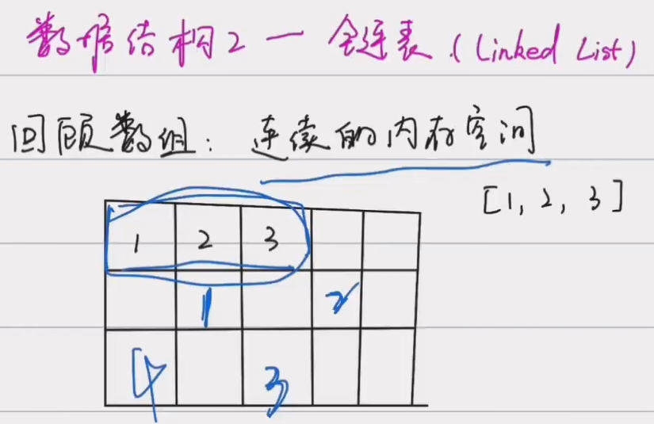
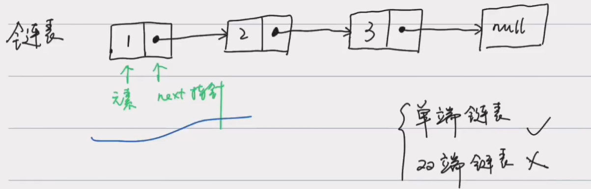
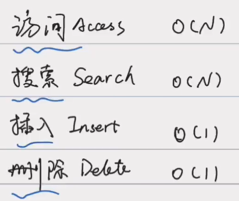
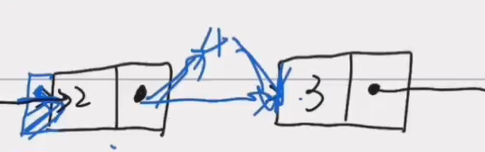
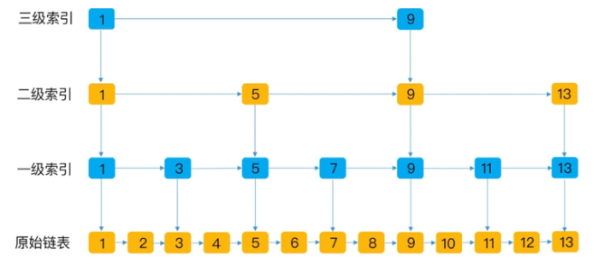

# 链表





```
value,val
next指针
```

## 时间复杂度



```markdown
访问和搜索都必须从头遍历到位
```

插入4，直接在内存空间找随便找一个地方，将元素二所在的next指针指向4，将4的指针指向3.



## 特点

```
适合读少写多
```


## 链表常用操作

```markdown
1. 创建链表
2. 添加元素
3. 访问元素
4. 查找元素
5. 删除元素
6. 更新元素
7. 链表的长度
```

### 创建链表

```java
LinkedList<Integer> list = new LinkedList<>();
```


### 添加元素

```java
// 时间复杂度O(1)
list.add(1);
list.add(2);
list.add(3);

// 时间复杂度O(N)，本质上链表插入操作还是O(1)，但是LinkedList是要遍历一遍索引
list.add(2, 99);
```


### 访问元素

```java
// 时间复杂度O(N)
int element = list.get(2);
// 99
```


### 查找/搜索元素

```java
// 时间复杂度O(N)
int index = list.indexOf(99);
// 2
```

### 更新元素

```java
// 时间复杂度O(N)
list.set(2, 88);
```


### 删除元素

```java
// 时间复杂度O(N)，本质上链表删除操作还是O(1)，但是LinkedList是要遍历一遍索引
list.remove(2)
```


### 链表的长度

```java
// 时间复杂度O(1)，LinkedList内部有一个变量，每次有一个添加操作，就会+1，删除操作，就会-1。当调用size()方法会直接放回一个结果，因此时间复杂度为O
int length = list.size();
// 3
```


## 练习

### [LeetCode203移除链表元素](https://leetcode-cn.com/problems/remove-linked-list-elements/)

给你一个链表的头节点 head 和一个整数 val ，请你删除链表中所有满足 Node.val == val 的节点，并返回 新的头节点 。

示例 1：


```
输入：head = [1,2,6,3,4,5,6], val = 6
输出：[1,2,3,4,5]
```

示例 2：

```
输入：head = [], val = 1
输出：[]
```

示例 3：

```
输入：head = [7,7,7,7], val = 7
输出：[]
```


提示：

- 列表中的节点在范围 `[0, 104]` 内
- `1 <= Node.val <= 50`
- `0 <= k <= 50`

题解

```java
```


### LeetCode206

反转链表


# 双向链表

二分之一，再遍历

# 跳表



空间换时间，一维到二维

```
在原始链表之上增加一级一级的索引，以此加快查询速度
```

随机数保持平衡

```

```

