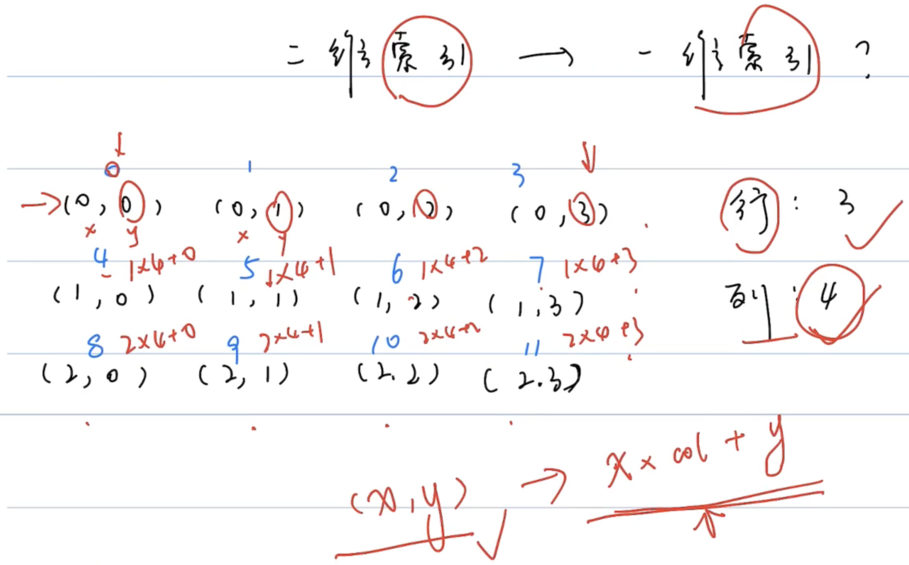

# 二分查找

> 排序数组中的搜索问题，首先想到 **二分法** 解决！

## 练习

### 剑指 Offer 04/LeetCode240.二维数组中的查找

视频：https://www.bilibili.com/video/BV1sy4y1q79M?p=53

在一个 n * m 的二维数组中，每一行都按照从左到右递增的顺序排序，每一列都按照从上到下递增的顺序排序。请完成一个`高效`的函数，输入这样的一个二维数组和一个整数，判断数组中是否含有该整数。

示例:

现有矩阵 matrix 如下：

```
[
  [1,   4,  7, 11, 15],
  [2,   5,  8, 12, 19],
  [3,   6,  9, 16, 22],
  [10, 13, 14, 17, 24],
  [18, 21, 23, 26, 30]
]
```

给定 target = `5`，返回 `true`。

给定 target = `20`，返回` false`。

限制：

- `0 <= n <= 1000`
- `0 <= m <= 1000`

**注意：**本题与主站 240 题相同：https://leetcode-cn.com/problems/search-a-2d-matrix-ii/

题解：

> 逆时针旋转45度，转换为二叉搜索树（对于每个元素，左边小，右边大）
>
> 比如target为5，如果遍历到的元素大于5，那么肯定在树的右边，就让i - 1

```java
class Solution {
    public boolean findNumberIn2DArray(int[][] matrix, int target) {
        int i = matrix.length - 1, j = 0;	// 从左下角开始走
        while(i >= 0 && j < matrix[0].length)
        {
            if(matrix[i][j] > target) i--;
            else if(matrix[i][j] < target) j++;
            else return true;	// 相等
        }
        return false;
    }
}
```

### [LeetCode74.. 搜索二维矩阵](https://leetcode-cn.com/problems/search-a-2d-matrix/)

编写一个`高效`的算法来判断` m x n `矩阵中，是否存在一个目标值。该矩阵具有如下特性：

每行中的整数从左到右按升序排列。
每行的第一个整数大于前一行的最后一个整数。

示例 1：


```
输入：matrix = [[1,3,5,7],[10,11,16,20],[23,30,34,60]], target = 3
输出：true
```

示例 2：


```
输入：matrix = [[1,3,5,7],[10,11,16,20],[23,30,34,60]], target = 13
输出：false
```


提示：

- `m == matrix.length`
- `n == matrix[i].length`
- `1 <= m, n <= 100`
- `-104 <= matrix[i][j], target <= 104`

题解：

>和上一题比，这里更加容易转换换为一维的有序数组，此时可以直接用一维数组二分查找做题目。
>
>根据题目，可以让二维索引转为一维索引：$index^{2纬} = (x,y) -> x * col + y = index^{1纬}$
>
>一维索引转二维索引：$index^{1纬}$ / col = x , $index^{1纬} $% col = y



```java
class Solution {
    public boolean searchMatrix(int[][] matrix, int target) {
        if(matrix == null | matrix.length == 0){
            return false;
        }
        int row = matrix.length;
        int col = matrix[0].length;
        int l = 0, r = row * col - 1;
        while(l <= r){
            int m = (l + r) / 2;
            int element = matrix[m / col][m % col];
            if(element == target){
                return true;
            }else if(element > target){
                r = m - 1;
            }else{
                l = m + 1;
            }
        }
        return false;
    }
}
```


### [剑指 Offer 53 - I. 在排序数组中查找数字 I](https://leetcode-cn.com/leetbook/read/illustration-of-algorithm/5874p1/)

统计一个数字在排序数组中出现的次数。

 

示例 1:

```
输入: nums = [5,7,7,8,8,10], target = 8
输出: 2
```

示例 2:

```
输入: nums = [5,7,7,8,8,10], target = 6
输出: 0
```


限制：

`0 <= 数组长度 <= 50000`

注意：本题与主站 34 题相同（仅返回值不同）：https://leetcode-cn.com/problems/find-first-and-last-position-of-element-in-sorted-array/

题解：

> 需要主要的是，边界处，是往左边二分，还是往右边二分

```java
```


### [剑指 Offer 53 - II. 0～n-1 中缺失的数字](https://leetcode-cn.com/leetbook/read/illustration-of-algorithm/58iqo5/)

一个长度为n-1的递增排序数组中的所有数字都是唯一的，并且每个数字都在范围0～n-1之内。在范围0～n-1内的n个数字中有且只有一个数字不在该数组中，请找出这个数字。

示例 1:

```
输入: [0,1,3]
输出: 2
```

示例 2:

```
输入: [0,1,2,3,4,5,6,7,9]
输出: 8
```


限制：

`1 <= 数组长度 <= 10000`

题解：

> 题目条件，0~n-1，如果按照顺序来，数组的下标与下标对应的元素应该是相等的。
>
> 那么应该分左子数组和右子数组，前者nums[i] == i
>
> 用二分查找

```java
class Solution {
    public int missingNumber(int[] nums) {
        int i = 0, j = nums.length - 1;
        while(i <= j){
            int m = (i + j) / 2;
            if(nums[m] == m){
                i = m + 1;
            }else{
                j = m - 1;
            }
        }
        return i;
    }
}
```

