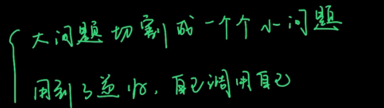
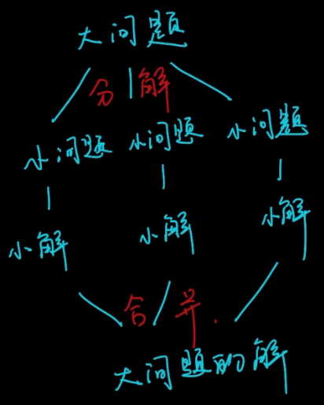
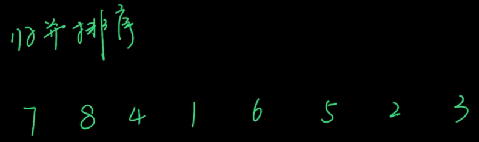
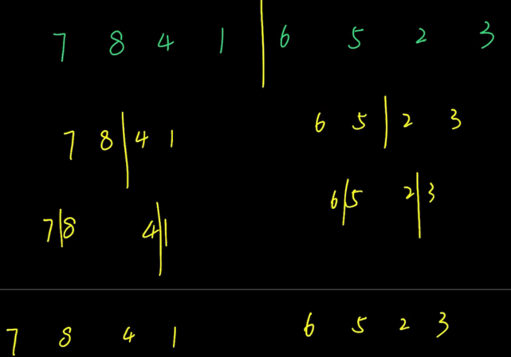

# 分治法

## 概念



可以理解为一种特殊的递归



举例，要求从小到大排序






## 练习

### [剑指 Offer 07. 重建二叉树](https://leetcode-cn.com/leetbook/read/illustration-of-algorithm/99lxci/)

输入某二叉树的前序遍历和中序遍历的结果，请重建该二叉树。假设输入的前序遍历和中序遍历的结果中都不含重复的数字。

例如，给出

```
前序遍历 preorder = [3,9,20,15,7]
中序遍历 inorder = [9,3,15,20,7]
```

返回如下的二叉树：

    	3
       / \
      9  20
        /  \
       15   7

限制：

`0 <= 节点个数 <= 5000`

注意：本题与主站 105 题重复：https://leetcode-cn.com/problems/construct-binary-tree-from-preorder-and-inorder-traversal/

题解：

```java
```


### 剑指 Offer 16. 数值的整数次方

实现` pow(x, n) `，即计算 x 的 n 次幂函数（即，$x^n$）。不得使用库函数，同时不需要考虑大数问题。

示例 1：

```
输入：x = 2.00000, n = 10
输出：1024.00000
```

示例 2：

```
输入：x = 2.10000, n = 3
输出：9.26100
```

示例 3：

```
输入：x = 2.00000, n = -2
输出：0.25000
解释：2-2 = 1/22 = 1/4 = 0.25
```


提示：

- `-100.0 < x < 100.0`
- `-231 <= n <= 231-1`
- `-104 <= xn <= 104`

注意：本题与主站 50 题相同：https://leetcode-cn.com/problems/powx-n/

题解：

>使用 long 的原因在于：Java 中 int32 变量区间 $n \in [-2147483648,2147483647] $，因此当 n = -2147483648n=−2147483648 时执行 n = -n 会因`越界`而赋值出错。解决方法是先将 n 存入 long 变量 b ，后面用 b 操作即可。

```java
class Solution {
    public double myPow(double x, int n) {
        if(x == 0.0f) return 0.0d;
        long b = n;
        double res = 1.0;
        if(b < 0) {		// 如果幂次方为负数，那么翻转x，并改幂次为正。方便解决问题
            x = 1 / x;
            b = -b;
        }
        while(b > 0) {
            if((b & 1) == 1) res *= x;	// 判断是否为奇数
            x *= x;
            b >>= 1;	// 右移一位，相当于，b //= 2
        }
        return res;
    }
}
```


### LeetCode169.多数元素

### [LeetCode53.最大子序和](https://leetcode-cn.com/problems/maximum-subarray) 


