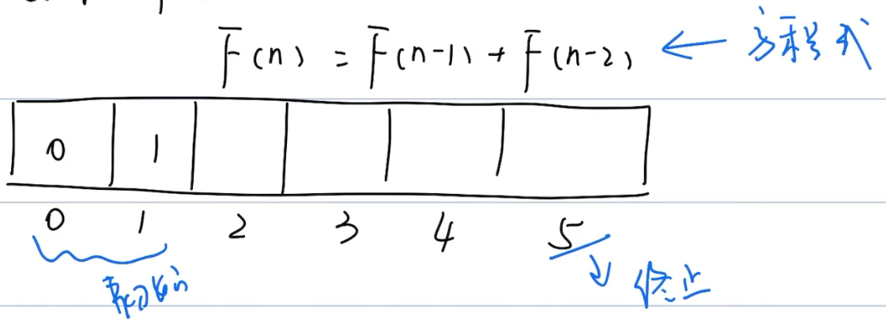

# 动态规划

## 概念

```markdown
题型千变万化
思路千变万化
```


### 动态规划四要素

```markdown
1. 初始状态
2. 方程式（状态转移方程）
3. 中间状态
4. 终止状态
```


### 动态规划的过程

#### 斐波那契-1维数组

$$
F(n)=F(n-1)+F(n-2)
$$




#### 机器人-2维数组

$$
F(r,c)=F(r-1,c)+F(r,c-1)
$$


其中，$F(r-1,c)$为上方格子， $F(r,c-1)$为左方格子

### 动态规划能干些什么

```markdown
1. 计数：
	有多少种方式|方法
    机器人从左上角到右下角多少个路径
    
2. 求最值：
	最大值 | 最小值
   	机器人从左 -> 右路径的最大数字和
   	
3. 求存在性:
	是否存在某个可能
	是否存在机器人从左 -> 右的路径
```


## 练习题

### LeetCode509斐波那契数列


### LeetCode62不同路经


### LeetCode121买卖股票的最佳时机


### LeetCode70爬楼梯


### LeetCode279完全平方数


### LeetCode221最大正方形