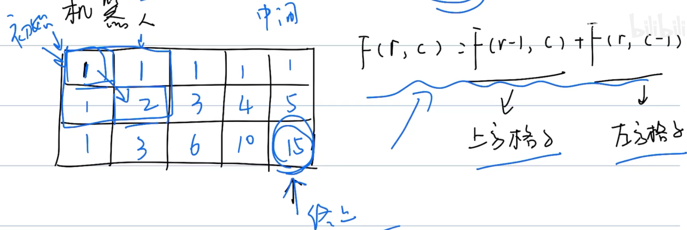

# 动态规划

## 概念

```markdown
题型千变万化
思路千变万化
```


### 动态规划四要素

```markdown
1. 初始状态
2. 方程式（状态转移方程）
3. 中间状态
4. 终止状态
```


### 动态规划的过程

#### 斐波那契-1维数组

$$
F(n)=F(n-1)+F(n-2)
$$


#### 机器人-2维数组

$$
F(r,c)=F(r-1,c)+F(r,c-1)
$$



其中，$F(r-1,c)$为上方格子， $F(r,c-1)$为左方格子

### 动态规划能干些什么

```markdown
1. 计数：
	有多少种方式|方法
    机器人从左上角到右下角多少个路径
    
2. 求最值：
	最大值 | 最小值
   	机器人从左 -> 右路径的最大数字和
   	
3. 求存在性:
	是否存在某个可能
	是否存在机器人从左 -> 右的路径
```


## 练习题

### 剑指 Offer 10- I/LeetCode509.斐波那契数列

写一个函数，输入` n `，求斐波那契（Fibonacci）数列的第` n `项（即` F(N)`）。斐波那契数列的定义如下：

```
F(0) = 0,   F(1) = 1
F(N) = F(N - 1) + F(N - 2), 其中 N > 1.
```

斐波那契数列由 0 和 1 开始，之后的斐波那契数就是由之前的两数相加而得出。

答案需要取模 1e9+7（1000000007），如计算初始结果为：1000000008，请返回 1。

示例 1：

```
输入：n = 2
输出：1
```

示例 2：

```
输入：n = 5
输出：5
```


提示：

- `0 <= n <= 100`

题解：

> 四大要素
>
> F(0) = 0,   F(1) = 1	初始状态
>
> F(N) = F(N - 1) + F(N - 2)	状态转移方程
>
> F(N) 终止状态

```java
class Solution {
    public int fib(int n) {
        int[] fibs = new int[101];
        fibs[0] = 0;	// 初始状态
        fibs[1] = 1;
        for(int i = 2; i <= n; i++){
            fibs[i] = (fibs[i -1] + fibs[i - 2]) % 1000000007;	// 状态转移方程
        }
        return fibs[n];	// 返回值
    }
}
```

### 剑指 Offer 10- II. 青蛙跳台阶问题//LeetCode70.爬楼梯

一只青蛙一次可以跳上1级台阶，也可以跳上2级台阶。求该青蛙跳上一个` n `级的台阶总共有多少种跳法。

答案需要取模 1e9+7（1000000007），如计算初始结果为：1000000008，请返回 1。

示例 1：

```
输入：n = 2
输出：2
```

示例 2：

```
输入：n = 7
输出：21
```

示例 3：

```
输入：n = 0
输出：1
```

提示：

- `0 <= n <= 100`

注意：本题与主站 70 题相同：https://leetcode-cn.com/problems/climbing-stairs/

题解：

```java
class Solution {
    public int numWays(int n) {
        if(n < 2){
            return 1;
        }
        int[] dp = new int[101];
        dp[0] = 1;	// 	确认初始值
        dp[1] = 1;
        dp[2] = 2;
        for(int i = 3; i <= n; i++){
            dp[i] = (dp[i - 1] + dp[i - 2]) % 1000000007;
        }
        return dp[n];
    }
}
```

### 剑指 Offer 42/LeetCode53. 连续子数组的最大和

输入一个整型数组，数组中的一个或连续多个整数组成一个子数组。求所有子数组的和的最大值。

要求时间复杂度为O(n)。 

示例1:

```
输入: nums = [-2,1,-3,4,-1,2,1,-5,4]
输出: 6
解释: 连续子数组 [4,-1,2,1] 的和最大，为 6。
```


提示：

- `1 <= arr.length <= 10^5`
- `-100 <= arr[i] <= 100`

注意：本题与主站 53 题相同：https://leetcode-cn.com/problems/maximum-subarray/

题解：

```java
```


### 剑指 Offer 47. 礼物的最大价值

在一个 m*n 的棋盘的每一格都放有一个礼物，每个礼物都有一定的价值（价值大于 0）。你可以从棋盘的左上角开始拿格子里的礼物，并每次向右或者向下移动一格、直到到达棋盘的右下角。给定一个棋盘及其上面的礼物的价值，请计算你最多能拿到多少价值的礼物？

示例 1:

```
输入: 
[
  [1,3,1],
  [1,5,1],
  [4,2,1]
]
输出: 12
解释: 路径 1→3→5→2→1 可以拿到最多价值的礼物
```


提示：

- `0 < grid.length <= 200`
- `0 < grid[0].length <= 200`


### 剑指 Offer 63. 股票的最大利润/LeetCode121.买卖股票的最佳时机

假设把某股票的价格按照时间先后顺序存储在数组中，请问买卖该股票一次可能获得的最大利润是多少？

示例 1:

```
输入: [7,1,5,3,6,4]
输出: 5
解释: 在第 2 天（股票价格 = 1）的时候买入，在第 5 天（股票价格 = 6）的时候卖出，最大利润 = 6-1 = 5 。
     注意利润不能是 7-1 = 6, 因为卖出价格需要大于买入价格；同时，你不能在买入前卖出股票。
```

示例 2:

```
输入: [7,6,4,3,1]
输出: 0
解释: 在这种情况下, 没有交易完成, 所以最大利润为 0。
```


限制：

- `0 <= 数组长度 <= 10^5`

注意：本题与主站 121 题相同：https://leetcode-cn.com/problems/best-time-to-buy-and-sell-stock/

题解：

> 初始状态dp[0] = 0
>
> 状态转移方程
> $$
> dp[i]=max(dp[i−1],prices[i]−min(prices[0:i]))
> $$
>
> $$
> 前i日最大利润=max(前(i−1)日最大利润,第i日价格−前i日最低价格)
> $$
>
> 即，对于第$i$天的最大利润，要么就是昨天$i-1$的==最大==利润更大，要么就是今天$i$的价格减掉之前的最低价格（从第$i$天截止）更大。

```java
class Solution {
    public int maxProfit(int[] prices) {
        int cost = Integer.MAX_VALUE, profit = 0;	// Integer.MAX_VALUE = 2147483647	初始状态，即第一天的利润为0。
        for(int price : prices) {	// prices[i]和profit[i](dp[i)是对应的
          	// 状态转移方程
            cost = Math.min(cost, price);
            profit = Math.max(profit, price - cost);		// 当前利润和当前价格 - 最小价格
        }
        return profit;	// 利润，profit就是返回值，相当于dp[i - 1]
    }
}
```


### LeetCode62.不同路经


### LeetCode70.爬楼梯


### LeetCode279.完全平方数


### LeetCode221.最大正方形