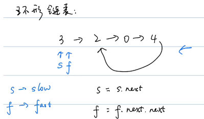

# 双指针

## 特点

```
两个指针解决一道题，是一种技巧！
```


| 类型       | 描述                                             | 适合场景 | 时间复杂度 |
| ---------- | ------------------------------------------------ | -------- | ---------- |
| 普通双指针 | 两个指针有时往同一个方向移动，有时往相反方向移动 |          |            |
| 对撞双指针 | 两个指针面对面移动，比如一个在头，一个在尾       | 有序数组 | O(N)       |
| 快慢双指针 | 慢指针 + 快指针                                  | 环形链表 |            |


### 快慢双指针



## 练习

### LeetCode141

### LeeCode881