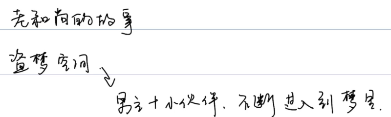
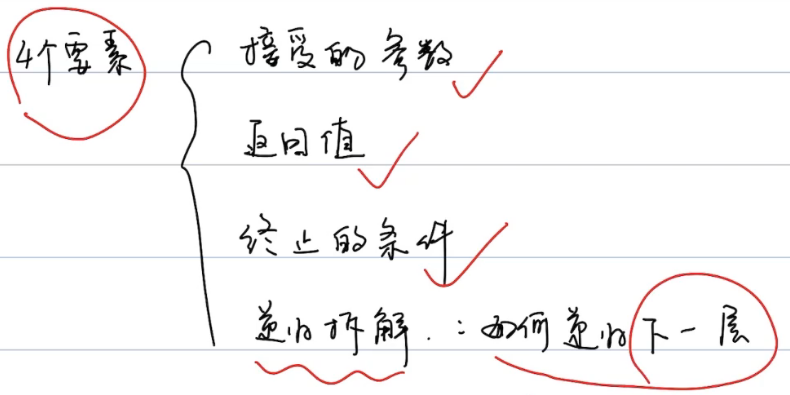
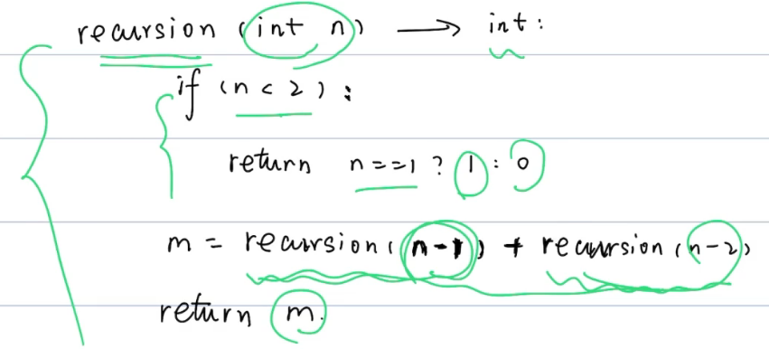

# 递归

## 定义

函数直接或者间接调用自己。


## 套娃




## 四个要素



```markdown
1. 参数
2. 返回值
3. 终止条件
4. 拆解
```





时间复杂度：O(2^N)

空间复杂度：O(N)	递归栈，先进后出


## 练习

### LeetCode509斐波那契数列

### LeetCode206反转链表

### LeetCode206反转字符串


